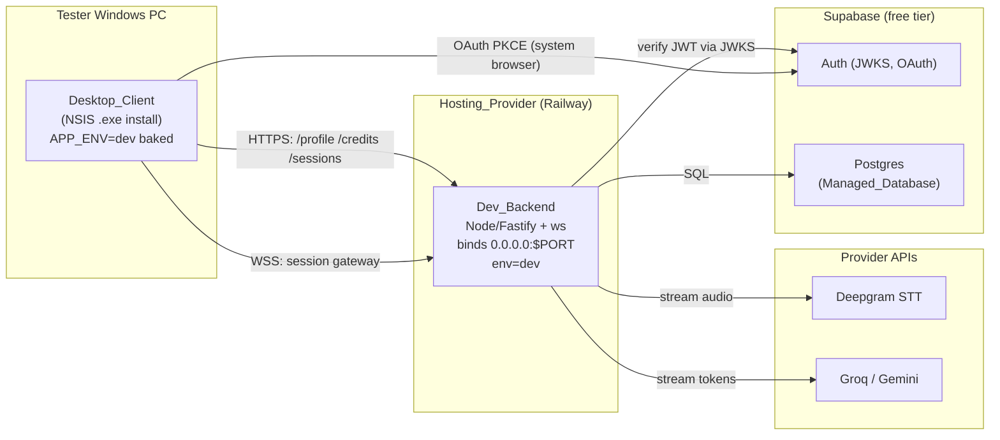

# Design Document

## Overview

This design covers the delta to ship a Dev/MVP build of the Interview Assistant SaaS: deploy the existing Node backend to a hosted `dev` environment on Railway, package the existing Electron client as a Windows installer that targets that backend, enforce Supabase auth in `dev` with a database `is_superuser` flag (owner-managed from the Supabase dashboard) that grants unlimited usage, make the minimize-to-pill control available on every screen, and add real branding plus release hardening.

It does **not** re-design the implemented system (session gateway, STT relay, LLM provider, credits ledger, orchestrator, overlay). It references those components and specifies only the changes and new modules required by `requirements.md` (Req 1–9). Non-goals (payments, hour-pack metering, tiers, fair-use, device caps, auto-update) are out of scope per the requirements.

Design principles for this delta:
- **Reuse the existing enforcement seam.** Superusers are modeled as "effective enforcement = bypassed," reusing the already-tested bypassed credit path rather than adding a parallel code path.
- **Bake dev config at build time.** The packaged client carries its `dev` endpoints + Supabase publishable key via electron-vite build-time env injection — no provider secrets, no tester configuration.
- **Single source of environment truth.** A baked `APP_ENV` drives both the client's `Resolved_Environment` and the screens it shows; the backend independently resolves its own env from `APP_ENVIRONMENT`.

## Architecture

### Deployment topology



TLS/WSS is terminated by the Hosting_Provider edge; the backend itself speaks plain HTTP/WS behind it. The desktop client holds only endpoint URLs + the Supabase publishable (anon) key; every Provider_Secret stays on the host (Req 2).

### Hosting recommendation (Req 1, 2)

| Option | WSS support | Free/cheap tier | Notes |
|---|---|---|---|
| **Railway (recommended)** | Yes | Trial credit, then low monthly (~$5 hobby) | Easiest DX; Dockerfile or Nixpacks; stable `*.up.railway.app` domain; no idle-sleep on paid hobby |
| Fly.io | Yes, native persistent connections | Small shared-cpu VM in free allowance | Dockerfile deploy; great WS; viable alternative |
| Render | Yes (Web Service) | Free web service **sleeps**; WS drops on idle | Avoid for live interviews |
| **Postgres: Supabase free tier (recommended)** | — | 1 project free | **Same vendor as auth** → one less integration; gives Postgres + Auth together |
| Postgres: Neon free tier | — | generous free | Alt if Supabase Postgres limits are hit; auth still on Supabase |

Decision: **Railway for the backend + Supabase free tier for Postgres and Auth.** Rationale: Railway gives the simplest deploy DX with first-class WebSocket support and a stable domain (no idle-sleep on the hobby tier, unlike Render's free web service), and consolidating Postgres+Auth on Supabase minimizes moving parts since auth already uses Supabase.

## Components and Interfaces

### A. Backend: host-ready bootstrap (Req 1)

**`packages/backend/index.ts` (change)**
- Bind to `0.0.0.0` and the host port: `host: process.env.HOST ?? '0.0.0.0'`, `port: Number(process.env.PORT ?? 8787)`. (Currently binds `127.0.0.1`, which is unreachable behind a platform proxy.)
- Run the schema migration on startup before listening (see B).

**`packages/backend/Dockerfile` (new)** — monorepo-aware multi-stage build:
- Copy root `package.json` + `package-lock.json` + `packages/shared` + `packages/backend`; `npm ci` at root (workspaces) so `@interview-assistant/shared` (TS source, consumed directly via tsx) resolves.
- Runtime: `node:20-slim`, run `npm run start --workspace @interview-assistant/backend` (which is `tsx index.ts`). `tsx` stays a dependency.
- Expose `$PORT`; no secrets baked — all via host env.

**`railway.json` (new, optional)** — pin the Dockerfile build + a health check path (`GET /credits/balance` or a dedicated `/healthz`) + restart policy. Railway injects `PORT` and provides a stable `*.up.railway.app` domain with TLS/WSS at the edge. A single service, always-on (hobby tier), is sufficient for MVP.

### B. Backend: schema migration runner (Req 1.4)

The docker-compose init mount does not exist on managed Postgres, so the schema must be applied programmatically.

**`packages/backend/db/migrate.ts` (new)**
- Reads `DATABASE_URL`, executes `db/schema.sql` (which is already idempotent: `CREATE TABLE IF NOT EXISTS`, `ALTER TABLE ... ADD COLUMN IF NOT EXISTS company/background`, `CREATE INDEX IF NOT EXISTS`, seed `ON CONFLICT DO NOTHING`).
- Exposed as `npm run migrate` and invoked on startup in `index.ts` (await `runMigrations(pool)` before `listen`), so every deploy converges the schema, including the `company`/`background` columns.

### C. Desktop: environment resolution + config injection (Req 4)

**`packages/desktop/electron.vite.config.ts` (change)** — inject build-time config via electron-vite's env handling. Build the dev installer with these set in the build environment (a `.env.dev` or CI vars):
- `MAIN_VITE_APP_ENV=dev`
- `MAIN_VITE_DEV_BACKEND_URL=https://<app>.up.railway.app`
- `MAIN_VITE_DEV_GATEWAY_URL=wss://<app>.up.railway.app`
- `MAIN_VITE_DEV_SUPABASE_URL=https://<ref>.supabase.co`
- `MAIN_VITE_DEV_SUPABASE_ANON_KEY=<publishable-anon-key>`

These are inlined into the main bundle as `import.meta.env.MAIN_VITE_*` (electron-vite/Vite define). They are **not secrets** (anon key + public URLs) (Req 2.5).

**`packages/desktop/main/envConfig.ts` (change)** — read endpoints from `import.meta.env.MAIN_VITE_*` (build-time inlined) with the existing `process.env` path retained for local dev runs. `dev` entry resolves to the baked URLs/keys.

**`packages/desktop/main/appController.ts` → `activeEnvironment()` (change)** — new precedence:
1. `process.env.APP_ENV` (explicit dev override at runtime), else
2. `import.meta.env.MAIN_VITE_APP_ENV` (baked at build), else
3. `app.isPackaged ? 'prod' : 'local'` (unchanged fallback).

So a packaged dev build resolves to `dev` (Req 4.2, 4.4). The existing dev indicator in `App.tsx` (shows env name when `env !== 'prod'`) satisfies Req 4.5.

### D. Backend: enforce auth in dev (Req 6)

**`packages/backend/config/environment.ts` (change)** — move `dev` from bypassed to enforced for **auth**:
- `resolveAuthMode`: `local` → bypassed; `dev`/`pre-prod`/`prod` → enforced; unknown → enforced.
- `resolveEnforcementMode` (credits): keep `local` → bypassed; `dev`/`pre-prod`/`prod` → enforced; unknown → enforced. (Superusers are handled per-account in F, not by the env mode.)

**`packages/desktop/main/envAuth.ts` (change)** — mirror: `dev` → enforced (so the client shows the sign-in screen and builds the Supabase adapter). `App.tsx`'s `isBypassed` helper updates so `dev` is no longer treated as bypassed → sign-in is required before Ready (Req 6.2).

Supabase project (dev) config: enable Email/Password and Google providers; add the desktop loopback redirect URL used by `pkce.ts` to the allowed redirect list. `DEV_SUPABASE_URL`/anon baked into the client; `SUPABASE_JWKS_URL`/issuer derive from `SUPABASE_URL` on the backend (already in `secrets.ts`).

### E. Backend: store email + superuser flag on the Account (Req 7, monitoring)

To let the owner **monitor users and grant superuser from the Supabase dashboard**, the superuser designation is a **database flag on the account**, not an env-var list, and the account stores the user's email so the dashboard user list is human-readable.

**`packages/backend/db/schema.sql` (change)** — add to `accounts` (idempotent):
- `email text` — captured on first sign-in for monitoring.
- `is_superuser boolean NOT NULL DEFAULT false` — the grant flag the owner toggles.
```
ALTER TABLE accounts ADD COLUMN IF NOT EXISTS email        text;
ALTER TABLE accounts ADD COLUMN IF NOT EXISTS is_superuser boolean NOT NULL DEFAULT false;
```

**`packages/shared/types.ts` (change)** — `Account` gains optional `email?: string` and `isSuperuser?: boolean`.

**`packages/backend/http/authVerifier.ts` + `repos` (change)** — on enforced verification, read `email` from the Supabase JWT payload and pass it to `accounts.provision(sub, email)`; `provision` upserts the email (so it stays current). `findByIdentityRef`/`provision`/`mapAccount` select and return `email` and `is_superuser`. The resolved `Account` therefore already carries `isSuperuser` — no separate lookup or claims plumbing needed.

### F. Backend: unlimited usage for superusers (Req 7)

**`packages/backend/session/sessionGateway.ts` (change)** — in `onAuth`, the resolved `account.isSuperuser` directly drives the **effective enforcement** for the session:
```
this.effectiveEnforcement = account.isSuperuser ? 'bypassed' : resolveEnforcementMode(env)
```
Use `effectiveEnforcement` everywhere the gateway currently uses `resolveEnforcementMode(env)`:
- `preSessionCheck(accountId, effectiveEnforcement)` → bypassed always authorizes (Req 7.4).
- `sessions.create({ ..., enforcement: effectiveEnforcement })` so the orchestrator's `checkCredits()` (which early-returns when enforcement !== 'enforced') performs **no hard stop** for superusers while still recording usage (Req 7.4).
- Regular dev accounts → `effectiveEnforcement = 'enforced'` → normal pre-session check + hard stop (Req 7.5).

This reuses the existing, tested bypassed path; no new enforcement logic in `creditsService`/orchestrator.

**Owner management & monitoring (no client rebuild, no redeploy):**
- **Monitor users:** the owner opens the Supabase **Table Editor** (or SQL) on the `accounts` table to see every registered user (email, created_at, is_superuser); `profiles`, `sessions`, and `usage_records` give per-user onboarding details and usage. Because the data lives in the Supabase-hosted Postgres, this is a zero-build admin surface for the dev release.
- **Grant/revoke superuser:** the owner flips the `is_superuser` checkbox on the user's `accounts` row in the Table Editor (or `UPDATE accounts SET is_superuser = true WHERE email = '...'`). It takes effect on that account's next session (Req 7.7) — no env var, no redeploy.

**Optional owner bootstrap:** `index.ts` may read a `SUPERUSER_BOOTSTRAP_EMAILS` env var and, when an account is provisioned/seen whose email is in that list, set `is_superuser = true` automatically — so the owner is a superuser on first sign-in without a manual toggle. The DB flag remains the source of truth.

### G. Desktop: minimize-to-pill on every screen (Req 8)

Today only `Overlay.tsx` renders the collapse button and the collapsed pill. Lift this to the app shell:

**`packages/desktop/renderer/App.tsx` (change)**
- Hold `const [collapsed, setCollapsed] = useState(false)` at the app level.
- Render a shared `<CollapsedPill onExpand={...}/>` when `collapsed` is true, **regardless of phase** — so collapse works on sign-in, onboarding, ready, and interview (Req 8.1, 8.2). Expanding simply sets `collapsed=false`; because phase state is untouched, the previously active screen reappears (Req 8.3, 8.6).
- Render a small always-present **minimize button** in the app chrome (top-right) for non-interview screens; the interview overlay keeps its in-toolbar collapse button (both call the same handler).

**`packages/desktop/renderer/components/CollapsedPill.tsx` (new, extracted)** — the pill markup currently inside `Overlay.tsx`, reused app-wide; uses the brand mark (H).

**`Overlay.tsx` (change)** — delegate collapse to the app-level handler (lift its `collapsed` state up) so there's one source of truth.

Window-level effects unchanged: `windowManager.setCollapsed()` resizes to the pill and `setContentHeight` is skipped while collapsed; **content protection is a window property already applied on every screen**, so the pill stays screen-share-invisible everywhere (Req 8.4, 8.5).

### H. Branding assets (Req 5)

**`packages/desktop/build/` (new)** — `icon.ico` (Windows multi-size: 16/24/32/48/64/128/256), `icon.png` (512) for any non-Windows tooling, optional `installerSidebar.bmp`/`installerHeader.bmp` for NSIS.

**`packages/desktop/renderer/components/Logo.tsx` (new)** — the In_App_Brand_Mark component replacing the placeholder `BrainLogo` usage in the toolbar/pill (Req 5.4). For the dev release a clean placeholder mark is acceptable; the asset slot and component are the deliverable.

**`electron-builder` config** wires `win.icon = build/icon.ico` (window/taskbar/installer icon, Req 5.2, 5.5) and `productName` (Req 5.3).

### I. Desktop packaging with electron-builder (Req 3)

**`packages/desktop/package.json` (change)** — add `electron-builder` (devDependency) and scripts:
- `"build:win": "electron-vite build && electron-builder --win --config electron-builder.yml"`
- electron-vite produces `out/{main,preload,renderer}`; electron-builder packages `out/**` + runtime `node_modules` (the externalized deps: `ws`, `@supabase/supabase-js`, `pdf-parse`, `mammoth`, react, etc.).

**`packages/desktop/electron-builder.yml` (new)**
```
appId: ai.interviewassistant.desktop
productName: Interview Assistant
directories: { output: dist, buildResources: build }
files: ["out/**", "package.json"]
win: { target: nsis, icon: build/icon.ico }
nsis: { oneClick: false, perMachine: false, allowToChangeInstallationDirectory: true, artifactName: "${productName}-Setup-${version}.exe" }
```
`asar` enabled; dev-only sources (TS, tests) are not in `out/` so they're excluded (Req 3.3). The packaged app launches and self-configures from baked `dev` config — no tester input (Req 3.4, 4 1). Code signing is out of scope for dev (testers will see SmartScreen; documented in README).

### J. Release hardening + safe logging (Req 9)

- **Redaction:** never log tokens or provider secrets. Audit existing `console.log`s: the gateway logs an account id (acceptable in dev, not a secret); ensure no `accessToken`/`refreshToken`/API-key values are ever logged. Add a tiny `redact()` helper used in any auth-event log line (Req 9.2).
- **Client bundle:** only `import.meta.env.MAIN_VITE_*` public values are inlined; provider secrets are never referenced in desktop code (verified by E/F living server-side) (Req 9.1, 9.4).
- **Missing config:** if `dev` `backendBaseUrl`/`sessionGatewayUrl` are empty at launch (build env not set), `appController` shows an error state ("Can't reach the configured backend") instead of falling through to another environment (Req 9.3).

## Data Models

This delta adds two columns to the existing `accounts` table and otherwise only configuration models (the `company`/`background` profile columns already exist).

### `accounts` table additions
| Column | Purpose |
|---|---|
| `email text` | Captured on first sign-in; makes the dashboard user list human-readable (monitoring) |
| `is_superuser boolean DEFAULT false` | Owner-toggled grant flag; drives unlimited usage |

### Backend host environment variables (Railway service variables)
| Var | Purpose |
|---|---|
| `APP_ENVIRONMENT=dev` | Resolves backend env → enforced auth + credits |
| `PORT` / `HOST` | `PORT` provided by Railway; bind 0.0.0.0:$PORT |
| `DATABASE_URL` | Supabase Postgres connection string |
| `SUPABASE_URL` | Derives JWKS + issuer for token verification |
| `SUPABASE_SERVICE_ROLE_KEY` | (server-only) if needed for admin ops |
| `DEEPGRAM_API_KEY` | Provider_Secret |
| `GROQ_API_KEY` (+ `DEFAULT_LLM_PROVIDER`/`DEFAULT_LLM_MODEL`) | Provider_Secret + model selection |
| `SUPERUSER_BOOTSTRAP_EMAILS` | Optional: auto-set `is_superuser` on first sign-in for these emails (e.g., the owner) |

### Desktop build-time environment variables (baked into the .exe)
| Var | Purpose |
|---|---|
| `MAIN_VITE_APP_ENV=dev` | Packaged build resolves to `dev` |
| `MAIN_VITE_DEV_BACKEND_URL` | HTTPS_Endpoint |
| `MAIN_VITE_DEV_GATEWAY_URL` | WSS_Endpoint |
| `MAIN_VITE_DEV_SUPABASE_URL` | Supabase project URL (public) |
| `MAIN_VITE_DEV_SUPABASE_ANON_KEY` | Supabase publishable key (public, not a secret) |

## Error Handling

- **Backend unreachable / WSS drop:** existing reconnect/backoff in `backendSessionClient` and Deepgram auto-reconnect already cover transient drops; no change.
- **Auth required but token missing/expired (dev):** `authVerifier` rejects with `AuthError` → gateway sends `auth_error` and closes; client returns to sign-in (existing path, now active in dev).
- **No superuser yet:** if no account has `is_superuser=true` (and no bootstrap email matches), everyone is a Regular_Account under enforcement (fail-closed, safe). The owner sets their flag (bootstrap env or dashboard toggle) before testing.
- **Missing baked dev config:** client shows an explicit unreachable-backend message (Req 9.3); does not silently connect elsewhere.
- **Migration failure on deploy:** `index.ts` logs and exits non-zero so the platform marks the deploy failed rather than serving with a stale schema.

## Testing Strategy

- **Unit (shared/backend):** `accounts` repo — `provision` upserts email and returns `is_superuser`; `mapAccount` maps both columns. `environment.ts` — `dev` now resolves auth=enforced, credits=enforced. `envAuth.ts` — `dev` enforced. `migrate.ts` — runs against a throwaway Postgres (or asserts idempotency by running twice), including the new `accounts` columns.
- **Backend integration:** gateway `onAuth` sets `effectiveEnforcement=bypassed` for an account with `is_superuser=true` (starts with zero balance) and `enforced` for a regular dev account (zero balance → pre-session rejection); optional `SUPERUSER_BOOTSTRAP_EMAILS` auto-sets the flag on first provision.
- **Desktop unit:** `activeEnvironment()` precedence (APP_ENV > baked MAIN_VITE_APP_ENV > packaged default); `envConfig` reads baked dev endpoints; App-level collapse renders the pill on every phase and restores the prior phase on expand.
- **Manual dev-release checklist:** install the .exe on a clean Windows VM; sign in (email + Google); superuser starts a session with no credits; regular account is blocked; minimize from each screen; confirm content protection on each screen; confirm no secrets in `out/` bundle or logs.

## Correctness Properties

### Property 1: Packaged dev build resolves to dev
A packaged dev build's `Resolved_Environment` is always `dev`, never `prod`.
**Validates: Requirements 4.2, 4.4**

### Property 2: Tokens verified in dev
In `dev`, an absent/invalid token is always rejected by the backend.
**Validates: Requirements 6.5**

### Property 3: Superusers never blocked
For an account with `is_superuser=true`, every session is authorized and never hard-stopped, regardless of balance.
**Validates: Requirements 7.4**

### Property 4: Regular accounts enforced
For a non-allow-listed dev account, normal pre-session and exhaustion enforcement always applies.
**Validates: Requirements 7.5**

### Property 5: No secret leakage
No Provider_Secret value appears in the desktop bundle, in client logs, or in any backend response.
**Validates: Requirements 2.3, 9.1, 9.2, 9.4**

### Property 6: Pill stays invisible
The collapsed pill preserves content protection on every screen.
**Validates: Requirements 8.4, 8.5**

### Property 7: Superuser toggled without rebuild or redeploy
Setting `is_superuser` on an account (via the Supabase dashboard/SQL) changes its membership on the next session, with no client rebuild and no backend redeploy.
**Validates: Requirements 7.7**

## Requirements Mapping

| Requirement | Design sections |
|---|---|
| 1 Backend deployment | A, B, Architecture/Hosting |
| 2 Server-side secrets | A, C (public-only config), Data models, J |
| 3 Windows packaging | I |
| 4 Packaged → dev backend | C |
| 5 Branding & icons | H, I |
| 6 Enforced auth in dev | D, E |
| 7 Superuser allow-list | E, F |
| 8 Minimize on every screen | G |
| 9 Release hardening & logging | J |
