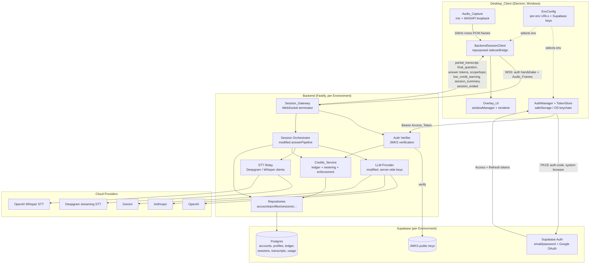
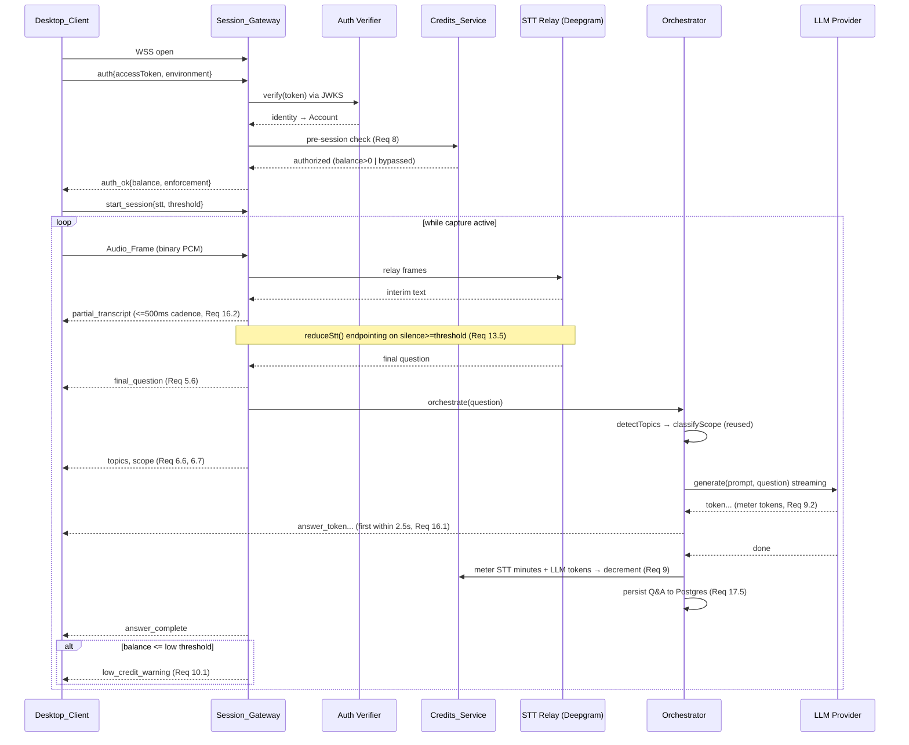
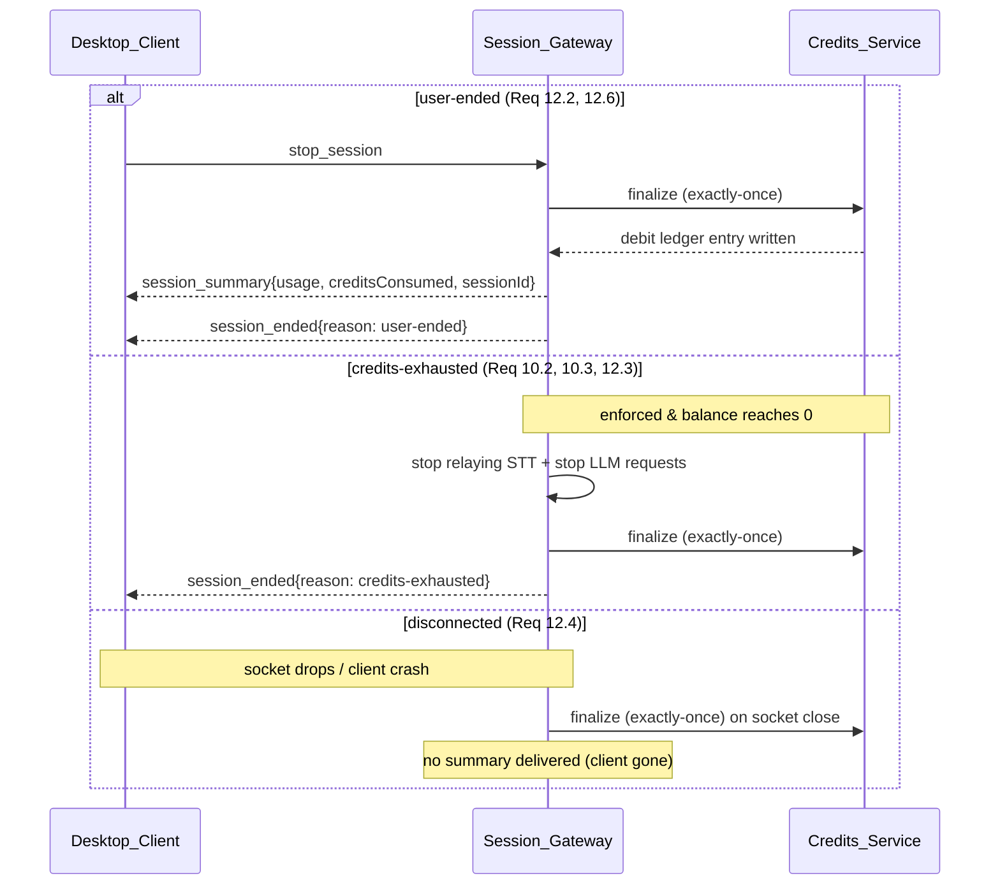

# Design Document: Interview Assistant SaaS (v2)

## Overview

The Interview Assistant SaaS (v2) evolves the existing single-machine Electron
desktop app (`it-interview-assistant`) into a thin desktop client plus a cloud
backend. The guiding principle of this design is **reuse, not rewrite**: the v1
codebase already contains a substantial body of pure, fully unit- and
property-tested domain logic (topic detection, scope checking, prompt building,
silence finalization/threshold resolution, session serialization, profile
merge/validation, LLM provider resolution). That logic is **relocated**
unchanged into a shared package and imported by both the client and the backend.
The pieces that genuinely change are the *boundaries*: audio capture moves from a
Python sidecar to native Electron; STT and LLM calls move server-side; auth and
billing/credits are new; persistence moves from local atomic JSON files to
Postgres.

This design maps every v1 module to an explicit action (reuse-as-is, modify,
relocate, repurpose, remove) and describes the new cloud surfaces — auth
verification, credits/metering, the realtime session gateway, and Postgres
persistence — that wrap the reused core. Design sections reference the
requirement numbers they satisfy (e.g. *Req 5.2*).

### Monorepo Package Structure

The product becomes a monorepo with three packages plus a shared core. The
shared package is pure (no Electron, no Node-server, no SDK side effects) so it
can be imported by both the desktop client and the backend without pulling in
platform code — exactly the property that made v1's `src/shared` and
`src/main/domain` modules safe to relocate.

```
packages/
  shared/                  # pure domain + types + client<->backend protocol
    domain/                # relocated v1 pure modules (Tier 1)
      topicDetector.ts
      scopeChecker.ts
      scopeColor.ts
      promptBuilder.ts
      sttFinalize.ts
      sttThreshold.ts
      session.ts           # serialize / deserialize / markdown
      profileMerge.ts
      profileValidation.ts
      llmResolve.ts
      geometry.ts          # client-side spatial math (relocated, used by desktop)
      captureToggle.ts     # client-side toggle reducer (relocated, used by desktop)
    types.ts               # Profile, QnAEntry, SessionFile, enums (+ new SaaS types)
    mappings.ts            # role adjacency + topic-role maps
    protocol.ts            # NEW: client<->backend session WebSocket protocol
    credits.ts             # NEW: pure Conversion_Rate + ledger-balance math
    __tests__/             # relocated property tests for the above

  desktop/                 # Electron client (Tier 3 + new client code)
    main/
      windowManager.ts     # reused ~as-is (overlay, content protection, hotkeys)
      backendSessionClient.ts  # REPURPOSED from sidecarBridge.ts
      authManager.ts       # NEW (Supabase PKCE, token store)
      tokenStore.ts        # NEW (safeStorage / OS keychain)
      envConfig.ts         # NEW (per-environment client config; replaces configLoader)
      preload.ts           # reused + extended (auth/env/credit channels)
    shared/ipc.ts          # reused + extended
    renderer/
      overlay/ setup/ overlayHeader.ts   # reused
      signIn/ envSelector/ creditBadge/  # NEW screens

  backend/                 # Node service (Fastify) + WebSocket session gateway
    http/
      authVerifier.ts      # NEW (Supabase JWKS verification)
      creditsService.ts    # NEW (ledger, metering, enforcement)
      accountsRepo.ts profilesRepo.ts sessionsRepo.ts ledgerRepo.ts usageRepo.ts
    session/
      sessionGateway.ts    # WebSocket terminator (NEW transport)
      sessionOrchestrator.ts   # MODIFIED from answerPipeline.ts
      sttRelay/
        deepgramClient.ts  # NEW streaming STT client
        whisperClient.ts   # NEW
      llmProvider.ts       # MODIFIED from v1 (server-side keys + usage metering)
    config/
      environment.ts       # NEW (enforcement mode, fail-safe enforced)
      secrets.ts           # NEW (server-side provider keys)
```

### v1 Reuse Map

Each v1 module is classified by action and destination. *Reuse-as-is* means the
code (and its tests) move verbatim; *modify* means the logic is kept but a
boundary changes; *repurpose* means the shape/contract is kept but it points at
a new collaborator; *remove* means deleted with no successor.

| v1 module | Action | Destination | Notes / requirement anchors |
|-----------|--------|-------------|------------------------------|
| `domain/topicDetector.ts` | reuse-as-is, relocate | `packages/shared/domain` | Topic_Detector (Req 14.1) |
| `domain/scopeChecker.ts` | reuse-as-is, relocate | `packages/shared/domain` | Scope_Checker totality (Req 14.2, 14.3) |
| `domain/scopeColor.ts` | reuse-as-is, relocate | `packages/shared/domain` | Scope badge color (Req 6.7) — used by renderer |
| `domain/promptBuilder.ts` | reuse-as-is, relocate | `packages/shared/domain` | Prompt_Builder (Req 14.4–14.7) |
| `domain/sttFinalize.ts` | reuse-as-is, relocate | `packages/shared/domain` | Endpointing reducer (Req 13.5, 13.7) — runs on backend |
| `domain/sttThreshold.ts` | reuse-as-is, relocate | `packages/shared/domain` | Silence threshold clamp/default (Req 13.6) |
| `domain/session.ts` | reuse-as-is, relocate | `packages/shared/domain` | serialize/deserialize/markdown (Req 7.5, 17.5) |
| `domain/profileMerge.ts` | reuse-as-is, relocate | `packages/shared/domain` | Profile merge (Req 17.2) |
| `domain/profileValidation.ts` | reuse-as-is, relocate | `packages/shared/domain` | Profile validation (Req 17.2) |
| `domain/llmResolve.ts` | reuse-as-is, relocate | `packages/shared/domain` | Provider recognition + model default (Req 15.2–15.4) |
| `shared/types.ts` | reuse + extend, relocate | `packages/shared/types.ts` | Add SaaS types (Account, LedgerEntry, etc.) |
| `shared/mappings.ts` | reuse-as-is, relocate | `packages/shared/mappings.ts` | Role adjacency + topic-role maps (Req 14.2) |
| domain property tests | reuse-as-is, relocate | `packages/shared/__tests__` | All existing PBT relocates |
| `llmProvider.ts` | **modify** | `packages/backend/session` | Keep provider-agnostic streaming+timeout; source keys from server secrets (Req 18); ADD token-usage metering hook (Req 9.2) |
| `answerPipeline.ts` | **modify** | `packages/backend/session` (`sessionOrchestrator.ts`) | Same topics→scope→prompt→LLM→persist→relay flow + generation-seq guard + regenerate; input from STT relay (not SidecarBridge); output over client WebSocket (not IPC); persist to Postgres; ADD metering + credit-enforcement checkpoints (Req 9, 10, 12, 14, 15) |
| `sessionManager.ts` | **modify** | `packages/backend/http` (`sessionsRepo.ts`) | Keep pure `session.ts` transforms; swap local atomic-file persistence for Postgres (Req 17.4, 17.5) |
| `windowManager.ts` | **modify (mostly as-is)** | `packages/desktop/main` | Keep frameless/always-on-top/transparent overlay, `setContentProtection(true)` exclusion + warning fallback, hotkeys, opacity, geometry constraints (Req 6.1–6.3, 4.3, 4.4) |
| `domain/geometry.ts` | reuse-as-is, relocate | `packages/shared/domain` (used by desktop) | Overlay spatial math (Req 6.1) |
| `domain/captureToggle.ts` | reuse-as-is, relocate | `packages/shared/domain` (used by desktop) | Capture toggle reducer (Req 4.3) |
| renderer `overlay/`, `setup/`, `overlayHeader.ts` | reuse + extend | `packages/desktop/renderer` | ADD sign-in screen, environment selector, credit-balance display (Req 1, 3, 7) |
| `shared/ipc.ts` | reuse + extend | `packages/desktop/shared` | ADD auth/env/credit channels |
| `preload.ts` | reuse + extend | `packages/desktop/main` | Expose new auth/env/credit IPC |
| `sidecarBridge.ts` | **repurpose** | `packages/desktop/main` (`backendSessionClient.ts`) | Same reconnect/backoff/command-queue + same event names (`partial_transcript`, `final_question`, `stt_error`, `capture_state`); connect to REMOTE gateway with Access_Token; ADD audio-frame upload (Req 5) |
| `shared/bridge.ts` | **repurpose** | `packages/shared/protocol.ts` | Evolve into client<->backend protocol: add auth handshake, audio frames up, new downbound messages `low_credit_warning`, `session_summary`, `session_ended{reason}` (Req 5, 10, 12) |
| `sidecar/` (Python dir) | **remove** | — | No offline mode; native Electron capture replaces it (Req 4.6) |
| Python STT backends (`stt.py`) | **remove/replace** | `packages/backend/session/sttRelay` | Node Deepgram streaming client is NEW; `sttFinalize.ts`/`sttThreshold.ts` pure logic IS reused for endpointing (Req 13) |
| `configLoader.ts` (config.yaml / BYO-key) | **remove/replace** | `packages/desktop/main/envConfig.ts` + `packages/backend/config/secrets.ts` | Client keeps small per-env config (backend URLs + Supabase keys); backend uses server-side secrets (Req 18) |
| `profileManager.ts` (local `~/.it` file) | **remove/replace** | `packages/backend/http/profilesRepo.ts` + client fetch | Postgres profile persistence + client fetch (Req 17.2) |

### Requirements Coverage Map (section → requirements)

| Design section | Requirements |
|----------------|--------------|
| Architecture | 1, 5, 17, 18, 19 |
| Session Protocol | 5, 6, 10, 12, 13, 15 |
| Auth Design | 1, 2, 18.6 |
| Environment & Deployment | 3, 19 |
| Native Audio Capture | 4 |
| Credits & Metering | 7, 8, 9, 10, 11 |
| STT Relay & Endpointing | 13 |
| Prompt / Topic / Scope | 14 |
| LLM Generation & Streaming | 15 |
| Latency | 16 |
| Data Models | 11, 17 |
| Security & Privacy | 18, 20 |
| Session Lifecycle / Finalization | 12 |

## Architecture

The system splits along a single trust boundary: everything secret (provider
API keys, credit enforcement, persistence) lives on the **Backend**; the
**Desktop_Client** holds only the Identity_Provider publishable key and the
user's own tokens (Req 18.6). The client captures audio and renders; the
backend transcribes, reasons, meters, and persists.



### Component Responsibilities

- **Audio_Capture (client, NEW):** captures microphone and Windows system-audio
  loopback natively in the Electron renderer, downsamples to 16 kHz mono PCM,
  frames the stream, and hands frames to the BackendSessionClient (Req 4).
- **BackendSessionClient (client, repurposed from `sidecarBridge.ts`):** keeps
  the v1 reconnect/backoff/command-queue and the four event names
  (`partial_transcript`, `final_question`, `stt_error`, `capture_state`) but
  connects to the *remote* Session_Gateway over WSS, sends the Access_Token on
  connect, and uploads Audio_Frames (Req 5).
- **AuthManager + TokenStore (client, NEW):** drives Supabase email/password and
  Google OAuth PKCE in the system browser; persists tokens in `safeStorage` /
  OS keychain; refreshes the Access_Token; falls back to the sign-in screen on
  refresh failure (Req 1, 2).
- **Overlay_UI (client, reused `windowManager.ts` + renderer):** frameless,
  always-on-top, transparent overlay with `setContentProtection(true)` exclusion
  and the warning fallback, hotkeys, opacity, geometry constraints; renderer
  gains sign-in, environment selector, and credit-balance views (Req 6, 4.3,
  4.4).
- **Auth Verifier (backend, NEW):** verifies the Supabase-issued Access_Token
  against the environment's JWKS, maps the verified identity to an Account, and
  provisions an Account + Credit_Ledger on first sign-in (Req 1.8, 1.9).
- **Credits_Service (backend, NEW):** maintains the Credit_Balance as the sum of
  the append-only Credit_Ledger, applies the Conversion_Rate, runs the
  pre-session check, decrements live during enforced sessions, emits the
  low-credit warning, performs the hard stop at zero, and finalizes exactly once
  (Req 7–11).
- **Session_Gateway (backend, NEW transport):** terminates the per-session
  WebSocket, authorizes the connection via the Auth Verifier, relays Audio_Frames
  to the STT Relay, and drives the Session Orchestrator; owns the three
  session-end paths (Req 5, 12).
- **Session Orchestrator (backend, modified `answerPipeline.ts`):** the same
  `topics → scope → prompt → LLM → persist → relay` flow with the generation-seq
  guard and regenerate, but fed by the STT relay, emitting over the client
  WebSocket, persisting to Postgres, with metering + enforcement checkpoints
  added (Req 14, 15, 9, 10, 12).
- **STT Relay (backend, NEW):** streams Audio_Frames to Deepgram (primary) or
  Whisper (acceptable), surfaces interim text, and uses the **reused**
  `sttFinalize`/`sttThreshold` pure logic for endpointing (Req 13).
- **Repositories + Postgres (backend, NEW persistence):** per-environment
  Supabase Postgres holding accounts, profiles, append-only ledger, sessions,
  transcripts/Q&A, and usage records (Req 17).

## Components and Interfaces

### Realtime Session Protocol (Req 5, 6, 10, 12, 13, 15)

The v1 `shared/bridge.ts` (a tiny newline-delimited JSON protocol between the
main process and the Python sidecar) is **repurposed** into the
client↔backend session protocol in `packages/shared/protocol.ts`. The four v1
event names are preserved so the client's repurposed bridge keeps its shape; new
messages are added for auth, audio upload, credits, and finalization.

Transport: a single persistent WebSocket per Session over WSS (Req 5.1, 20.3).
Control messages are JSON text frames; Audio_Frames are sent as binary frames
(little-endian 16-bit PCM) to avoid base64 overhead. Every message carries the
implicit session identity established at connect.

#### Upbound messages (Desktop_Client → Session_Gateway)

```ts
// packages/shared/protocol.ts
export type ClientToServer =
  // Auth handshake — first frame after the socket opens (Req 5.2).
  | { type: 'auth'; accessToken: string; environment: Environment }
  // Start relaying after pre-session credit check passes (Req 12.1).
  | { type: 'start_session'; sttProvider: SttProviderName; silenceThresholdSeconds?: number }
  // Toggle/declare capture state from the client (Req 4.3, 4.4).
  | { type: 'capture_state'; active: boolean; systemAudioAvailable: boolean }
  // Graceful stop initiated by the user (Req 5.8, 12.2).
  | { type: 'stop_session' }

// Audio is a BINARY frame, not JSON:
//   ArrayBuffer of Int16 PCM, 16 kHz, mono, ~20–40 ms per frame (Req 5.3, 4).
```

#### Downbound messages (Session_Gateway → Desktop_Client)

```ts
export type ServerToClient =
  // Connection accepted / rejected after auth verification (Req 5.2).
  | { type: 'auth_ok'; accountId: string; creditBalance: number; enforcement: EnforcementMode }
  | { type: 'auth_error'; message: string }
  // Live transcript + finalized question (reused v1 event names) (Req 5.4, 5.6).
  | { type: 'partial_transcript'; text: string }
  | { type: 'final_question'; text: string }
  // Topic + scope badges for the current question (Req 6.6, 6.7).
  | { type: 'topics'; topics: TopicDomain[] }
  | { type: 'scope'; scope: ScopeClassification; color: string }
  // Streamed answer tokens + completion (Req 5.5, 15.5).
  | { type: 'answer_token'; token: string }
  | { type: 'answer_complete'; answer: string }
  // STT failure — session stays open (reused name) (Req 5.7, 13.8).
  | { type: 'stt_error'; message: string }
  // LLM backend/timeout error — no answer for that question (Req 15.6).
  | { type: 'answer_error'; provider: string; message: string }
  // Credit warnings + lifecycle (NEW) (Req 10.1, 12.6).
  | { type: 'low_credit_warning'; creditBalance: number; threshold: number }
  | { type: 'session_summary'; usage: UsageSummary; creditsConsumed: number; sessionId: string }
  | { type: 'session_ended'; reason: SessionEndReason }

export type SessionEndReason = 'user-ended' | 'credits-exhausted' | 'disconnected'
```

#### End-to-end question → answer flow



#### The three session-end paths (Req 12.2–12.4)



In all three paths finalization runs through a single idempotent
`finalizeSession(sessionId)` routine (Req 12.5, 12.7) — see *Credits & Metering*.

### Auth Design (Req 1, 2, 18.6)

Authentication is delegated to **Supabase Auth** as the third-party
Identity_Provider, one Supabase project per Environment (Req 19.7). The client
never sees a provider API key — only the Supabase publishable (anon) key for the
selected environment (Req 18.6).

**Auth enforcement per environment (Req 1.11, 1.12, 19.8–19.10).** This entire
section applies only where `resolveAuthMode(env)` is `enforced` (pre-prod, prod,
and any missing/unknown environment via fail-safe). Where it is `bypassed`
(local, dev), the Desktop_Client skips the sign-in screen and opens the Session
without obtaining or sending an Access_Token, the Session_Gateway accepts the
connection without a token, and the Backend skips Token_Verification and
attributes the Session to the environment's **Dev_Account**. No tokens are stored
on the client in bypassed environments.

**Sign-in methods.**
- *Email/password* (Req 1.1): the AuthManager calls Supabase's password
  grant via the supabase-js client; on failure it surfaces a generic
  "authentication failed" message that does not reveal which field was wrong
  (Req 1.4).
- *Google OAuth* (Req 1.2): an **authorization-code-with-PKCE** flow conducted in
  the **system browser** (never an embedded webview). The client generates a
  PKCE `code_verifier`/`code_challenge`, opens the system browser to Supabase's
  authorize URL, and receives the redirect on a transient `http://127.0.0.1:<port>`
  loopback listener (or a custom `app://` protocol handler), then exchanges the
  code + verifier for tokens.

**Token issuance & storage.** On success Supabase issues a short-lived
Access_Token (JWT) and a longer-lived Refresh_Token (Req 1.3, 1.5). The
TokenStore persists both **only** in the OS secure credential store via Electron
`safeStorage` (encrypted blob keyed in the OS keychain/DPAPI) (Req 2.1, 2.5).

```ts
// packages/desktop/main/tokenStore.ts
export interface TokenStore {
  save(env: Environment, tokens: { accessToken: string; refreshToken: string }): Promise<void>
  load(env: Environment): Promise<{ accessToken: string; refreshToken: string } | null>
  clear(env: Environment): Promise<void>
}
```

**Session restoration & refresh.**
- On launch, if an unexpired Refresh_Token exists, restore the session without
  prompting (Req 2.2). If the IdP is unreachable, still attempt restoration from
  stored tokens rather than prompting (Req 2.3).
- When the Access_Token is expired and the Refresh_Token is valid, obtain a new
  Access_Token using the Refresh_Token (Req 1.6).
- If refresh fails or the Refresh_Token is invalid/expired, return to the sign-in
  screen (Req 1.7). If a stored token cannot be read/decrypted, show the sign-in
  screen **and** an error that the saved session could not be restored (Req 2.6).
- With no unexpired token, show the sign-in screen (Req 2.4).

**Sign-out** deletes both tokens from the TokenStore and ends the Supabase
session (Req 1.10).

**Backend verification.** Every Backend request (HTTP and the WebSocket connect)
carries the Access_Token. The Auth Verifier validates the JWT signature against
the environment's Supabase **JWKS**, checks `exp`/`aud`/`iss`, and maps the
verified `sub` to an Account. Absent/expired/invalid tokens are rejected with an
authorization error and the operation is not performed (Req 1.8, 5.2). On a
verified identity with no existing Account, the Backend provisions the Account
and its empty Credit_Ledger in one transaction (Req 1.9). Where `resolveAuthMode`
is `bypassed`, this verification is skipped entirely and the request is
attributed to the environment's Dev_Account (Req 1.12, 5.2a).

### Environment Selection & Deployment (Req 3, 19)

There are four environments: `local`, `dev`, `pre-prod`, `prod`. Each deployed
environment has its **own** Supabase project (auth + Postgres) and its own
Backend instance, giving per-environment identity and data isolation (Req 19.6,
19.7).

```ts
// packages/desktop/main/envConfig.ts
export type Environment = 'local' | 'dev' | 'pre-prod' | 'prod'
export interface EnvEntry {
  backendBaseUrl: string      // HTTP base for Credits_Service etc.
  sessionGatewayUrl: string   // WSS base for the Session_Gateway
  supabaseUrl: string
  supabasePublishableKey: string  // anon key only — never a provider key (Req 18.6)
}
export type EnvConfig = Record<Environment, EnvEntry>
```

Client behavior:
- The user selects exactly one Environment (Req 3.1). All subsequent
  Credits_Service and Session_Gateway requests go to that environment's base URL
  and use that environment's Supabase config (Req 3.2, 3.3).
- While an environment is selected, the client shows an environment indicator
  (Req 3.4); with none selected it hides the indicator (Req 3.5).
- Changing environments while signed in signs the user out of the previous
  environment and shows the new environment's sign-in screen; if sign-out fails
  it still proceeds to the new sign-in screen (Req 3.6).
- If the selected environment was `prod`, the next launch defaults to `prod`
  (Req 3.7).

Backend behavior:
- Each Backend instance is configured with its Environment, from which it derives
  the **Credit_Enforcement_Mode**: bypassed for `local`/`dev`, enforced for
  `pre-prod`/`prod` (Req 19.1–19.4).
- If the environment configuration that determines enforcement is missing or
  unreadable, the Backend **fails safe to enforced** (Req 19.5). This is a pure
  decision function (see Properties).
- Auth enforcement follows the same per-environment boundary and fail-safe via
  `resolveAuthMode`: `bypassed` for `local`/`dev`, `enforced` for
  `pre-prod`/`prod`, fail-safe `enforced` on missing/unknown config (Req
  19.8–19.10). In bypassed environments the gateway attributes the Session to the
  Dev_Account instead of a verified identity.

```ts
// packages/backend/config/environment.ts
export type EnforcementMode = 'enforced' | 'bypassed'
export function resolveEnforcementMode(env: Environment | undefined | null): EnforcementMode {
  if (env === 'local' || env === 'dev') return 'bypassed'
  if (env === 'pre-prod' || env === 'prod') return 'enforced'
  return 'enforced' // fail-safe: missing/unknown → enforced (Req 19.5)
}

// Authentication enforcement uses the SAME per-environment boundary and the
// SAME fail-safe as credits (Req 19.8–19.10). local/dev disable auth entirely
// (they exist only for integration/performance testing); pre-prod/prod require
// Supabase sign-in + Token_Verification.
export type AuthMode = 'enforced' | 'bypassed'
export function resolveAuthMode(env: Environment | undefined | null): AuthMode {
  if (env === 'local' || env === 'dev') return 'bypassed'
  if (env === 'pre-prod' || env === 'prod') return 'enforced'
  return 'enforced' // fail-safe: missing/unknown → enforced (Req 19.10)
}
```

When `resolveAuthMode` is `bypassed`, the Backend skips Token_Verification and
attributes every request and Session to a fixed synthetic **Dev_Account** within
that environment's Supabase project (a normal `accounts` row), so credits
metering, session persistence, and the data model continue to function for
integration and performance testing without a verified identity (Req 1.12,
19.8). The Desktop_Client correspondingly skips the sign-in screen and connects
without a token (Req 1.12, 5.2a).

### Native Audio Capture (Req 4)

The Python sidecar is removed (Req 4.6). Audio is captured natively inside the
Electron process:

- **Microphone:** `navigator.mediaDevices.getUserMedia({ audio })` in the
  renderer (Req 4.1).
- **Windows system-audio loopback:** Electron 31's loopback capture via
  `session.setDisplayMediaRequestHandler` with `{ audio: 'loopback' }`, exposing
  WASAPI loopback as a capturable stream (Req 4.2).
- Both streams are processed by an `AudioWorklet` that downmixes to mono,
  resamples to **16 kHz**, and emits **Int16 PCM** frames (~20–40 ms each). The
  mic and loopback streams are mixed (summed with clipping protection) into one
  PCM stream for upload (Req 4.1, 4.2).
- The capture hotkey toggles capture active/inactive using the **reused**
  `captureToggle` reducer; the Overlay_UI shows a capture indicator while active
  (Req 4.3, 4.4).
- If loopback is unavailable, capture continues with the microphone only, shows a
  "system-audio degraded" indication, and reports the degraded state via the
  `capture_state` message (`systemAudioAvailable: false`) (Req 4.5).
- All capture happens in-process; no subprocess is launched (Req 4.6).

Frames flow to the BackendSessionClient, which uploads them as binary WebSocket
frames while a session is open and capture is active (Req 5.3).

### STT Relay & Endpoint Detection (Req 13)

The Session_Gateway relays uploaded Audio_Frames to the configured STT_Provider
as a streaming request (Req 13.1):
- **Deepgram** (primary) via its streaming WebSocket API (Req 13.2).
- **OpenAI Whisper** (acceptable) via its streaming/transcription API (Req 13.3).

Interim results become `partial_transcript` messages (Req 13.4). The **reused**
pure modules drive endpointing: `resolveSilenceThreshold` clamps the configured
threshold to `[0.3, 5.0]` with a `1.5s` default (Req 13.6), and `reduceStt`
finalizes a Question when a silence interval `>=` threshold follows recognized
speech (Req 13.5), producing nothing for speechless audio (Req 13.7). When no
frames are arriving, the gateway simply waits (Req 13.9). If the STT provider is
unreachable or returns nothing within 2s of relayed audio, the gateway sends
`stt_error` and keeps the session open (Req 13.8).

### Prompt, Topic Detection & Scope (Req 14)

These are reused verbatim from v1 in `packages/shared/domain`. On each finalized
Question the orchestrator runs `detectTopics` (deduplicated, possibly empty set,
Req 14.1), then `classifyScope` which always returns exactly one classification
and maps an empty topic set to `out-of-scope` (Req 14.2, 14.3). `buildSystemPrompt`
constructs the first-person, seniority-adapted prompt and frames it by scope:
expert for in-scope, exposure/cross-team for adjacent, well-rounded senior for
out-of-scope (Req 14.4–14.7).

### LLM Generation & Streaming (Req 15)

`llmProvider.ts` is **modified** from v1: the provider-agnostic streaming +
30-second-timeout structure and the `claude`/`openai`/`gemini` backends are kept
verbatim (Req 15.2–15.4, 15.6), but:
- API keys are sourced from **server-side** secrets, never from client config or
  user input (Req 18.1, 18.4).
- A **token-usage metering hook** is added. Each backend already iterates the
  provider stream; the modification reads the SDK's usage object
  (`message_delta.usage` for Anthropic, `chunk.usage` / final usage for OpenAI,
  `usageMetadata` for Gemini) and reports `{ promptTokens, completionTokens }` to
  the Credits_Service via an injected `onUsage` callback (Req 9.2).

```ts
// packages/backend/session/llmProvider.ts (added to v1 interface)
export interface LlmProvider {
  generate(
    req: LlmRequest,
    onToken: (t: string) => void,
    onUsage?: (u: { promptTokens: number; completionTokens: number }) => void,
  ): Promise<LlmResult>
}
```

Tokens stream to the client as `answer_token` as produced (Req 15.5); the first
token targets `<= 2.5s` after end-of-question (Req 16.1). On error/timeout the
gateway sends `answer_error` naming the provider and yields no answer for that
question (Req 15.6).

### Credits & Metering (Req 7, 8, 9, 10, 11)

The Credits_Service is built around a **pure core** (`packages/shared/credits.ts`)
wrapped by a Postgres-backed repository. Keeping the arithmetic pure makes the
ledger and conversion invariants property-testable.

**Conversion_Rate.** A pure, monotonic, non-negative mapping from metered STT
minutes and LLM tokens to credits (Req 9.3):

```ts
// packages/shared/credits.ts
export interface ConversionRate {
  creditsPerSttMinute: number   // >= 0
  creditsPerLlmToken: number    // >= 0
}
export interface Usage { sttMinutes: number; llmTokens: number } // both >= 0

export function usageToCredits(rate: ConversionRate, u: Usage): number {
  return rate.creditsPerSttMinute * u.sttMinutes + rate.creditsPerLlmToken * u.llmTokens
}

export type LedgerEntryType =
  | 'usage-debit'        // enforced debit, reduces balance (Req 11.1)
  | 'non-enforced-debit' // dev/local marker, recorded but does NOT reduce enforced balance (Req 11.5)
  | 'purchase-credit'    // future credit addition (Req 11.4) — not used in v2

export interface LedgerEntry {
  id: string
  accountId: string
  type: LedgerEntryType
  amount: number        // signed: debits negative, credits positive
  sessionId?: string
  createdAt: string
}

// Balance = sum of enforced-affecting entries (Req 11.2).
export function ledgerBalance(entries: LedgerEntry[]): number {
  return entries
    .filter((e) => e.type !== 'non-enforced-debit')
    .reduce((sum, e) => sum + e.amount, 0)
}
```

**Pre-session check (Req 8).** When the user requests to start, the
Credits_Service evaluates the balance before the gateway relays audio (Req 8.1):
- enforced & balance > 0 → authorize, never reject for insufficient credits
  (Req 8.2);
- enforced & balance <= 0 → reject; client shows "insufficient credits"
  (Req 8.3);
- bypassed → authorize regardless of balance (Req 8.4).

**Live metering & decrement (Req 9).** While the session is open the service
meters STT minutes relayed and LLM tokens consumed (Req 9.1, 9.2), converts via
the Conversion_Rate (Req 9.3), and — when enforced — decrements the live balance
as usage accrues (Req 9.4). When bypassed it records a Usage_Record without
decrementing (Req 9.5).

**Low-credit warning & hard stop (Req 10).** When enforced and the balance falls
to/below the Low_Credit_Threshold, the gateway sends `low_credit_warning` and the
overlay displays it (Req 10.1). When enforced and the balance reaches zero, the
gateway stops relaying audio to STT and stops requesting LLM answers (Req 10.2),
finalizes with reason `credits-exhausted`, and notifies the client (Req 10.3).
When bypassed, no hard stop occurs (Req 10.4).

**Ledger & exactly-once finalization (Req 11, 12.5, 12.7).** On finalization the
service appends **exactly one** debit entry recording the credits consumed
(Req 11.1) — `usage-debit` when enforced, `non-enforced-debit` when bypassed so
dev usage is recorded without reducing an enforced balance (Req 11.5). The ledger
is append-only (Req 11.3) and every entry carries a type distinguishing usage
debits from future purchase credits (Req 11.4). Idempotency is enforced with a
**unique constraint** on `(session_id, type)` for debit entries plus a
`finalized_at` guard on the session row, so repeated finalization triggers (user
stop racing a disconnect, retries) never write a second debit (Req 12.7).

```ts
// packages/backend/http/creditsService.ts
async function finalizeSession(sessionId: string): Promise<void> {
  // Single transaction:
  //  1. SELECT ... FOR UPDATE the session row; if finalized_at set → return (idempotent).
  //  2. Compute final usage → usageToCredits(rate, usage).
  //  3. INSERT one debit ledger entry (type by enforcement) — unique(session_id,type).
  //  4. Persist transcript + Q&A + usage_record.
  //  5. SET sessions.finalized_at = now(), end_reason.
  // A duplicate INSERT violates the unique constraint and is swallowed as a no-op.
}
```

### Credit Balance Display & Session History (Req 7)

On restoring/establishing an authenticated session the client requests and
displays the current Credit_Balance from the Credits_Service (Req 7.1). When a
session ends with a `session_summary`, the client updates the displayed balance
by the credits consumed (Req 7.2). The history view lists the user's persisted
sessions (Req 7.3); selecting one shows its persisted transcript and Q&A
(Req 7.4); the export control produces Markdown containing every Question and
answer using the **reused** `exportSessionMarkdown` (Req 7.5).

### Latency Design (Req 16)

Targets: Time_To_First_Answer_Token `<= 2.5s` from end-of-question (Req 16.1);
`partial_transcript` cadence `<= 500ms` while interim text is produced
(Req 16.2). The gateway records per-stage latency for audio relay,
end-of-question detection, prompt construction, first STT result, and first
answer token for each Question (Req 16.3).

Dominant levers and how the design hides latency:
- **Silence threshold** is the largest fixed contributor to perceived delay;
  the default `1.5s` (clamped `0.3–5.0`) trades responsiveness against premature
  cutoff (reused `sttThreshold`).
- **LLM choice/region co-location:** the Backend and the LLM/STT regions are
  co-located to minimize round-trips; provider selection trades quality vs.
  TTFT.
- **Streaming everywhere:** partial transcripts and incremental answer tokens
  let the user read before generation completes, hiding total latency. The
  orchestrator emits the first token as soon as the provider yields it.
- Per-stage timestamps are attached to each Question and persisted with the
  Usage_Record for monitoring.

### Security & Privacy (Req 18, 20)

- All provider API keys live server-side and are never exposed to the client;
  each key is transmitted only to its own provider API (Req 18.1–18.5, 20.1).
  The client holds only the Supabase publishable key; the Supabase service-role
  key is server-side only (Req 18.6).
- All Session audio, transcripts, and tokens travel over encrypted transport
  (WSS/HTTPS) (Req 20.3).
- Screen-capture exclusion is preserved via the reused `windowManager`
  `setContentProtection(true)` with the keep-rendered warning fallback
  (Req 20.2, 6.2, 6.3).
- Every persisted transcript/Q&A is associated with exactly one owning Account;
  the Backend rejects any request to read another user's data (Req 17.7, 20.5).
- Session deletion removes the transcript and Q&A but **retains** the
  corresponding Credit_Ledger entry (Req 20.4); a partial-deletion failure still
  retains the ledger entry and reports the deletion as incomplete (Req 20.6).

## Data Models

Persistence is **per-environment Supabase Postgres** (Req 17, 19.6). Each
environment is a separate Supabase project (separate database), so data created
in one environment is physically unreachable from another — isolation is by
project boundary, not just by a column (Req 19.6, 19.7). Within a project, every
user-owned table carries an `account_id` foreign key and is protected by
Row-Level Security so a user can read only their own rows (Req 17.7, 20.5).

### Shared TypeScript types (relocated + extended)

The v1 `Profile`, `QnAEntry`, `SessionFile`, and enums move to
`packages/shared/types.ts` unchanged. New SaaS types are added alongside:

```ts
export interface Account {
  id: string                 // internal account id (uuid)
  identityRef: string        // Supabase user id (sub)
  createdAt: string
}
export type SttProviderName = 'deepgram' | 'whisper'
export interface UsageSummary { sttMinutes: number; llmTokens: number; creditsConsumed: number }
export type SessionEndReason = 'user-ended' | 'credits-exhausted' | 'disconnected'
// ConversionRate, Usage, LedgerEntry, LedgerEntryType, Environment, EnforcementMode
// are defined in shared/credits.ts and shared/protocol.ts (above).
```

### Postgres schema

```sql
-- Accounts: one per verified identity. Provisioned on first sign-in (Req 1.9, 17.1).
-- In auth-bypassed environments (local/dev) a fixed synthetic Dev_Account row is
-- seeded with a reserved identity_ref (e.g. 'dev-account') and used to attribute
-- all Sessions/usage/ledger entries (Req 1.12, 19.8).
CREATE TABLE accounts (
  id            uuid PRIMARY KEY DEFAULT gen_random_uuid(),
  identity_ref  text NOT NULL UNIQUE,          -- Supabase auth user id (sub)
  created_at    timestamptz NOT NULL DEFAULT now()
);

-- Profiles: one current profile per account (Req 17.2). Replaces the local ~/.it file.
CREATE TABLE profiles (
  account_id        uuid PRIMARY KEY REFERENCES accounts(id) ON DELETE CASCADE,
  name              text NOT NULL,
  target_role       text NOT NULL,
  experience_years  int  NOT NULL CHECK (experience_years BETWEEN 0 AND 60),
  role_categories   text[] NOT NULL,
  seniority         text NOT NULL,             -- Junior|Mid|Senior|Staff|Principal
  skills            text[] NOT NULL,
  company_type      text NOT NULL,             -- Startup|Product|Service|FAANG
  updated_at        timestamptz NOT NULL DEFAULT now()
);

-- Sessions: one per interview, with end reason and timing (Req 17.4, 12).
CREATE TABLE sessions (
  id             uuid PRIMARY KEY DEFAULT gen_random_uuid(),
  account_id     uuid NOT NULL REFERENCES accounts(id) ON DELETE CASCADE,
  profile_snapshot jsonb NOT NULL,             -- frozen Profile at session start
  started_at     timestamptz NOT NULL DEFAULT now(),
  ended_at       timestamptz,
  end_reason     text,                         -- user-ended|credits-exhausted|disconnected
  finalized_at   timestamptz,                  -- exactly-once finalization guard (Req 12.7)
  enforcement    text NOT NULL                 -- enforced|bypassed at session time
);
CREATE INDEX ON sessions(account_id, started_at DESC);

-- Transcript / Q&A history: one row per finalized Q&A pair (Req 17.5).
-- Deletable on session deletion; the ledger entry is retained (Req 20.4).
CREATE TABLE qna_entries (
  id          uuid PRIMARY KEY DEFAULT gen_random_uuid(),
  session_id  uuid NOT NULL REFERENCES sessions(id) ON DELETE CASCADE,
  account_id  uuid NOT NULL REFERENCES accounts(id) ON DELETE CASCADE,
  seq         int  NOT NULL,                   -- order within the session
  question    text NOT NULL,
  answer      text NOT NULL,
  topics      text[] NOT NULL,
  scope       text NOT NULL,                   -- in-scope|adjacent|out-of-scope
  created_at  timestamptz NOT NULL DEFAULT now(),
  UNIQUE (session_id, seq)
);

-- Append-only credit ledger (Req 11). Balance = SUM over enforced-affecting rows (Req 11.2).
CREATE TABLE credit_ledger (
  id          uuid PRIMARY KEY DEFAULT gen_random_uuid(),
  account_id  uuid NOT NULL REFERENCES accounts(id) ON DELETE RESTRICT,
  type        text NOT NULL,                   -- usage-debit|non-enforced-debit|purchase-credit
  amount      numeric NOT NULL,                -- signed; debits negative, credits positive
  session_id  uuid REFERENCES sessions(id) ON DELETE SET NULL,  -- retained after session delete (Req 20.4)
  created_at  timestamptz NOT NULL DEFAULT now()
);
-- Exactly-once: at most one debit per session (Req 12.7).
CREATE UNIQUE INDEX one_debit_per_session
  ON credit_ledger(session_id, type)
  WHERE type IN ('usage-debit','non-enforced-debit');
-- Append-only enforced by triggers/policy: no UPDATE or DELETE permitted (Req 11.3).
REVOKE UPDATE, DELETE ON credit_ledger FROM PUBLIC;

-- Usage records: metered STT minutes + LLM tokens per session (Req 17.6, 9).
CREATE TABLE usage_records (
  id           uuid PRIMARY KEY DEFAULT gen_random_uuid(),
  session_id   uuid NOT NULL REFERENCES sessions(id) ON DELETE CASCADE,
  account_id   uuid NOT NULL REFERENCES accounts(id) ON DELETE CASCADE,
  stt_minutes  numeric NOT NULL DEFAULT 0,
  llm_tokens   bigint  NOT NULL DEFAULT 0,
  latency_ms   jsonb,                          -- per-stage latency (Req 16.3)
  created_at   timestamptz NOT NULL DEFAULT now()
);
```

**Append-only ledger (Req 11.3):** `UPDATE`/`DELETE` are revoked on
`credit_ledger`; corrections are made by appending compensating entries, never by
mutating history. `session_id` uses `ON DELETE SET NULL` so deleting a session
retains its ledger entry (Req 20.4).

**Per-account isolation (Req 17.7, 20.5):** Supabase Row-Level Security policies
restrict every user-facing table to `account_id = auth.uid()`-mapped account.
Cross-account reads are rejected at the database layer in addition to
application checks.

**Per-environment isolation (Req 19.6):** because each environment is a separate
Supabase project, there is no shared table space across environments — isolation
is structural.

## Correctness Properties

*A property is a characteristic or behavior that should hold true across all
valid executions of a system — essentially, a formal statement about what the
system should do. Properties serve as the bridge between human-readable
specifications and machine-verifiable correctness guarantees.*

This project continues v1's property-based-testing approach using **fast-check**.
The reused Tier-1 modules relocate to `packages/shared` **with their existing
property tests**, so their guarantees (topic detection, prompt building, session
round-trip, LLM resolution, capture toggle, scope color) carry over unchanged.
The properties below restate the two reused guarantees the requirements
explicitly call out (scope totality, silence-threshold clamping) and add the new
SaaS guarantees for credits, finalization, enforcement, isolation, and protocol.

Each property is implemented by a single property-based test running a minimum of
100 iterations, tagged `Feature: interview-assistant-saas, Property {n}: {text}`.

### Property 1: Credit balance equals the sum of ledger entries

*For any* account and *any* sequence of Credit_Ledger entries appended for that
account, the reported Credit_Balance equals the sum of the `amount` of all
balance-affecting entries (entries of type `usage-debit` and `purchase-credit`),
and excludes `non-enforced-debit` entries.

**Validates: Requirements 11.2**

### Property 2: Finalization is exactly-once (idempotent)

*For any* session and *any* number of finalization triggers for that session
(including a user-stop racing a disconnect and repeated retries), the
Credit_Ledger contains at most one debit entry for that session and the computed
balance change equals that of a single finalization.

**Validates: Requirements 11.1, 12.7**

### Property 3: Conversion_Rate is monotonic and non-negative

*For any* non-negative Conversion_Rate and *any* two usage values `u1` and `u2`
where `u1` is component-wise less than or equal to `u2` (STT minutes and LLM
tokens), `usageToCredits(rate, u1) <= usageToCredits(rate, u2)`, and
`usageToCredits(rate, u)` is always `>= 0`.

**Validates: Requirements 9.3**

### Property 4: Bypassed enforcement never decrements the enforced balance

*For any* session run while the Credit_Enforcement_Mode is bypassed and *any*
metered usage, the appended ledger entry is marked `non-enforced-debit`, a
Usage_Record is recorded, and the account's enforced Credit_Balance after
finalization equals its balance before the session (no decrement).

**Validates: Requirements 9.5, 10.4, 11.5**

### Property 5: Pre-session check authorizes correctly

*For any* enforcement mode and *any* Credit_Balance, the pre-session check
authorizes the session start if and only if the mode is bypassed, or the mode is
enforced and the balance is strictly greater than zero; an enforced session with
a balance of zero or less is always rejected.

**Validates: Requirements 8.2, 8.3, 8.4**

### Property 6: Enforcement-mode resolution is total and fails safe to enforced

*For any* environment value — including any missing, unknown, or unreadable
configuration — both `resolveEnforcementMode` and `resolveAuthMode` return
exactly one of `enforced` or `bypassed`, return `bypassed` only for `local` and
`dev`, and return `enforced` for `pre-prod`, `prod`, and every missing/unknown
input.

**Validates: Requirements 19.1, 19.2, 19.3, 19.4, 19.5, 19.8, 19.9, 19.10**

### Property 7: Per-account data isolation

*For any* two distinct accounts A and B and *any* session, transcript, or Q&A
history owned by A, a read request authenticated as B is rejected and never
returns A's data, while a read request authenticated as A returns it.

**Validates: Requirements 17.7, 20.5**

### Property 8: Session deletion retains the ledger entry

*For any* finalized session that has a corresponding Credit_Ledger debit entry,
deleting the session removes its transcript and Q&A history while leaving the
Credit_Ledger entry intact and the account's Credit_Balance unchanged.

**Validates: Requirements 20.4**

### Property 9: Session protocol message round-trip

*For any* valid client↔backend protocol message (any `ClientToServer` or
`ServerToClient` variant), encoding the message and then decoding it produces a
message deep-equal to the original, and malformed inputs decode to a recognized
"ignored" result rather than throwing.

**Validates: Requirements 5.4, 5.5, 5.6, 5.7, 10.1, 12.6**

### Property 10: Scope classification is total (reused)

*For any* set of detected topics, *any* declared profile roles, and *any*
adjacency/topic-role maps, `classifyScope` returns exactly one of `in-scope`,
`adjacent`, or `out-of-scope`, and returns `out-of-scope` whenever the detected
topic set is empty.

**Validates: Requirements 14.2, 14.3**

### Property 11: Silence-threshold clamping (reused)

*For any* configured silence-threshold value (including absent and `NaN`),
`resolveSilenceThreshold` returns a value within `[0.3, 5.0]`, returns the
default `1.5` when the value is absent or `NaN`, and returns in-range values
unchanged.

**Validates: Requirements 13.6**

## Error Handling

Errors are handled at the boundary where they occur, and the session stays alive
wherever the requirements allow it.

**Authentication & token errors (Req 1, 2).**
- Rejected credentials → generic "authentication failed" message that never
  reveals which field was wrong (Req 1.4).
- Expired Access_Token with a valid Refresh_Token → silent refresh (Req 1.6);
  refresh failure or invalid/expired Refresh_Token → return to sign-in (Req 1.7).
- IdP unreachable at launch → attempt restoration from stored tokens rather than
  prompting (Req 2.3).
- Unreadable/undecryptable stored token → sign-in screen + "saved session could
  not be restored" error (Req 2.6).
- Backend: absent/expired/invalid Access_Token → authorization error, operation
  not performed (Req 1.8); WebSocket connect with a bad token → `auth_error` and
  the connection is rejected (Req 5.2).

**Session/transport errors (Req 5, 12).** The repurposed BackendSessionClient
keeps v1's bounded reconnect-with-backoff and command queue. A dropped socket or
client crash during a session causes the gateway to finalize with reason
`disconnected` (Req 12.4); the client surfaces a disconnected status and attempts
reconnection.

**STT errors (Req 13.8).** If the STT provider is unreachable or returns nothing
within 2s of relayed audio, the gateway emits `stt_error` and keeps the session
open. Speechless audio simply produces no transcript and finalizes no Question
(Req 13.7).

**LLM errors (Req 15.6).** On a backend error or a 30-second timeout (reused
timeout structure), the request is aborted, no answer is produced for that
Question, and `answer_error` names the configured provider. The generation-seq
guard (reused from v1) ensures a superseded generation's late tokens are dropped.

**Credit errors (Req 8, 10).** Enforced start with zero balance → start rejected,
client shows "insufficient credits" (Req 8.3). Reaching zero mid-session
(enforced) → hard stop, finalize as `credits-exhausted`, notify the client
(Req 10.2, 10.3).

**Persistence & deletion errors (Req 20.6).** Finalization writes ledger entry +
transcript + usage in one transaction; a duplicate finalize is swallowed by the
unique constraint (Req 12.7). A session-deletion failure that has already removed
part of the transcript still retains the Credit_Ledger entry and reports the
deletion as incomplete to the user (Req 20.6).

**Enforcement config errors (Req 19.5).** Missing/unreadable environment config
fails safe to `enforced`.

## Testing Strategy

The strategy is the dual approach proven in v1: **property-based tests** for
universal invariants and **example/integration tests** for concrete behavior and
external wiring.

### Property-based tests (fast-check, >= 100 iterations each)

PBT applies to the pure logic layers — the relocated Tier-1 domain modules and
the new pure credit/enforcement/protocol cores. Each property in *Correctness
Properties* maps to exactly one property test tagged
`Feature: interview-assistant-saas, Property {n}: {text}`:

- Properties 1–8 are NEW and live in `packages/shared` (credits, enforcement,
  protocol) and `packages/backend` (finalization idempotency, isolation,
  deletion) using a deterministic in-memory repository model so 100+ iterations
  are cheap and free of Postgres/network calls.
- Properties 10–11 are the **reused** v1 property tests relocated verbatim with
  their modules; the wider reused suite (topic detection dedup, prompt content
  invariants, session serialize round-trip, LLM provider resolution, capture
  toggle inverse, scope color distinctness) relocates unchanged.
- Generators cover edge cases the prework flagged: empty topic sets, whitespace
  STT chunks, out-of-range and `NaN` thresholds, zero/negative balances, large
  token/minute usage, and arbitrary ledger-entry sequences mixing all three
  entry types.

### Unit / example tests

- Auth: generic-error masking (Req 1.4), refresh-to-sign-in fallback (Req 1.7),
  unreadable-token path (Req 2.6).
- Environment: indicator show/hide (Req 3.4, 3.5), sign-out-on-change including
  sign-out failure (Req 3.6), prod-default-on-next-launch (Req 3.7).
- Lifecycle: end-reason assignment for each of the three end paths (Req
  12.2–12.4), `session_summary` only on user-ended (Req 12.6).
- LLM: timeout via injected mock clock + fake backend (reused harness, Req 15.6).

### Integration tests (1–3 representative examples each — NOT property tests)

- Supabase JWKS verification and first-sign-in Account+ledger provisioning (Req
  1.8, 1.9).
- Deepgram / Whisper streaming relay producing interim + final results (Req
  13.1–13.4).
- LLM streaming for each provider (Req 15.2–15.5) including SDK usage extraction
  for metering (Req 9.2).
- WebSocket connect/auth/reject and end-to-end question→answer over the gateway
  (Req 5).
- Postgres repositories: append-only ledger rejecting UPDATE/DELETE (Req 11.3),
  RLS rejecting cross-account reads (Req 20.5), `ON DELETE SET NULL` retaining
  ledger entries (Req 20.4).

### Smoke tests (single execution)

- Screen-capture exclusion via `setContentProtection(true)` (reused
  `privacy.smoke`, Req 6.2, 20.2).
- Native audio capture initialization for mic + Windows loopback, including the
  loopback-unavailable degraded path (Req 4.5).
- Server-side-only key configuration: the client bundle contains no provider key
  (Req 18.3, 18.6).
- Encrypted transport (WSS/HTTPS) configured for the gateway and HTTP API (Req
  20.3).

### Latency verification (Req 16)

Per-stage latency timestamps are recorded with each Usage_Record (Req 16.3) and
asserted against the budgets (TTFT `<= 2.5s`, partial cadence `<= 500ms`) in
integration/performance checks rather than property tests, since these are
performance targets rather than input-varying logic.
