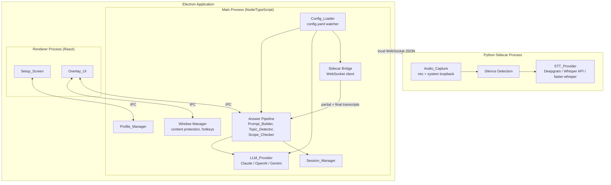
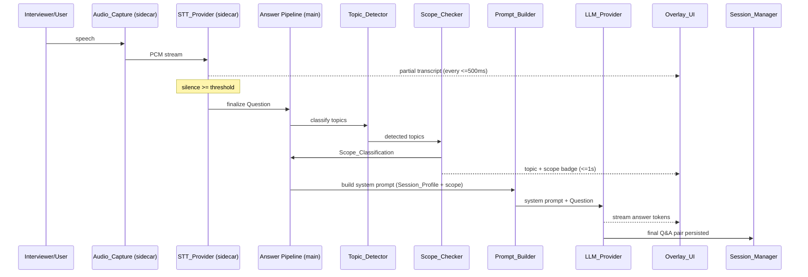

# Design Document

## Overview

The IT Interview Assistant is a cross-platform desktop application (macOS 13+ and Windows 11) that listens to interview audio, transcribes spoken questions in real time, classifies each question by topic and scope relative to the candidate's profile, and streams expert-level, first-person answers from a configurable LLM provider onto a transparent, screen-capture-excluded overlay.

The application is built on **Electron** with a **TypeScript/React** frontend. Electron is chosen because it is the only mainstream cross-platform desktop runtime that natively supports both the visual requirements (frameless, always-on-top, per-window opacity) and the critical screen-capture-exclusion requirement through `BrowserWindow.setContentProtection(true)`, which maps to `WDA_EXCLUDEFROMCAPTURE` on Windows 11 and `NSWindowSharingNone` on macOS.

A separate **Python sidecar process** handles audio capture and the local `faster-whisper` speech-to-text engine, because robust system-audio loopback capture and local Whisper inference are best served by the Python ecosystem (`sounddevice`, `faster-whisper`). The sidecar communicates with the Electron main process over a local WebSocket on `127.0.0.1` using newline-delimited JSON messages. All network-backed providers (Deepgram, OpenAI Whisper, Claude, OpenAI, Gemini) are invoked from the Electron main process in TypeScript.

The design deliberately concentrates the **deterministic domain logic** — profile merging, prompt construction, topic detection, scope classification, configuration validation, value clamping, overlay bounds geometry, and session serialization — into pure, side-effect-free TypeScript modules. This keeps the high-value correctness rules independent of I/O so they can be exhaustively validated with property-based tests.

### Key Design Goals

- **Latency**: First answer content visible within 3 seconds of question finalization (Req 15.1); transcription within 2 seconds (Req 5.1).
- **Invisibility**: Overlay never appears in any screen capture on either OS (Req 10.2), with graceful degradation and warning when unsupported (Req 10.3).
- **Provider neutrality**: STT and LLM backends are swappable via `config.yaml` with hot reload (Req 8, 9).
- **Privacy**: No telemetry; keys live only in the local config file; profile data only under the user home directory (Req 16).
- **Resilience**: Network, configuration, and file errors degrade gracefully with clear indications rather than crashing (Req 5.8, 8.5–8.7, 9.4, 2.4, 2.6).

### Scope Boundaries (Version 1)

Resume parsing, multi-language STT, mobile support, cloud sync, interviewer video capture, and mock interview mode are out of scope, consistent with the requirements introduction.

## Architecture

### Process Topology



### Layered Responsibilities

| Layer | Location | Responsibility |
|-------|----------|----------------|
| Presentation | Renderer (React) | Setup_Screen, Overlay_UI rendering, hotkey-triggered visibility, opacity, drag/resize |
| Window/OS | Main process | Content protection, always-on-top, global hotkeys, display bounds, clipboard |
| Orchestration | Main process | Answer pipeline wiring, sidecar lifecycle, streaming relay |
| Domain (pure) | Main process modules | Profile merge, prompt build, topic detect, scope classify, validation, clamping, geometry, serialization |
| Providers | Main process + sidecar | LLM backends (TS), STT backends and audio capture (Python) |
| Persistence | Main process | `profile.json`, session JSON/Markdown, `config.yaml` read/watch |

### Data Flow: Question to Answer



### Why a Python Sidecar

`faster-whisper` (Req 5.7) and reliable cross-platform system-audio loopback have no first-class Node equivalent. Isolating these in a sidecar keeps the audio/STT concerns independent of the UI process, allows the sidecar to be restarted without dropping the overlay, and keeps the testable domain logic in TypeScript. The bridge protocol is intentionally thin: the sidecar emits `partial_transcript`, `final_question`, `stt_error`, and `capture_state` events; the main process sends `start_capture`, `stop_capture`, and `configure` commands.

## Components and Interfaces

### Config_Loader

Reads `config.yaml` at the project root, validates it, exposes a typed `AppConfig`, and watches the file for changes to support hot reload (Req 9.1, 9.2). On a detected change it re-validates and publishes a new immutable config snapshot to subscribers (pipeline, LLM provider, sidecar bridge). API keys are passed only to their matching provider clients (Req 9.3, 16.1).

```typescript
interface AppConfig {
  llm: { provider: string; model?: string; apiKey?: string };
  stt: { provider: string; apiKey?: string; silenceThresholdSeconds?: number };
  audio: { micDeviceId?: string; systemDeviceId?: string };
  overlay: { opacityPercent?: number; backgroundTransparency?: number };
}

interface ConfigValidationResult {
  ok: boolean;
  config?: AppConfig;
  errors: ConfigError[]; // each names the missing/invalid setting
}

interface ConfigLoader {
  load(): ConfigValidationResult;
  watch(onChange: (result: ConfigValidationResult) => void): Disposable;
}
```

A required-setting check (Req 9.4) returns a `ConfigError` naming each missing key. Provider-name validation for the LLM (Req 8.5, 8.6) is performed here and surfaced before any answer attempt.

### Profile_Manager

Loads, persists, and merges the candidate profile. Reads `~/.it-interview-assistant/profile.json` on launch (Req 2.1, 2.2), falls back to system defaults when the file is absent (Req 2.3) or unreadable/invalid (Req 2.4), and never writes outside the user home directory (Req 2.10, 16.3).

```typescript
interface Profile {
  name: string;                 // <= 100 chars
  targetRole: string;           // <= 100 chars
  experienceYears: number;      // 0..60
  roleCategories: string[];     // 1..10 on confirm
  seniority: SeniorityLevel;    // exactly one
  skills: string[];             // 1..50 when roles selected
  companyType: CompanyType;     // exactly one
}

type LoadOutcome =
  | { kind: 'loaded'; profile: Profile }
  | { kind: 'defaulted'; profile: Profile }          // file absent
  | { kind: 'error-defaulted'; profile: Profile; message: string }; // unreadable/invalid

interface ProfileManager {
  loadDefault(): LoadOutcome;
  saveDefault(p: Profile): { ok: boolean; message: string };
  mergeSession(base: Profile, override: Partial<Profile>): Profile; // pure
}
```

`mergeSession` is the pure merge function central to Req 2.9: for any field present in the override, the override value wins; all other fields keep the default value.

### Setup_Screen Validation

Pure validators enforce the field constraints (Req 1.3–1.7) and the confirmation gate (Req 1.10, 1.11). Validation returns the set of missing/invalid mandatory fields so the UI can mark each one.

```typescript
interface ProfileValidation {
  valid: boolean;
  missingMandatory: Array<'roleCategories' | 'seniority' | 'companyType'>;
  fieldErrors: FieldError[]; // range/length violations
}
function validateProfile(p: Partial<Profile>): ProfileValidation; // pure
```

### Audio_Capture (sidecar)

Captures microphone and system audio as PCM streams in real time (Req 4.1, 4.2). Exposes a toggle controlled by the audio-capture hotkey relayed from the main process (Req 4.3) and reports capture state so the Overlay_UI can show the active indicator (Req 4.4). System-audio loopback uses WASAPI loopback on Windows and an aggregate/loopback device on macOS; when system loopback is unavailable the sidecar reports a degraded capture state.

### STT_Provider (sidecar)

Performs speech-to-text against a selectable backend (Req 5.5–5.7) and runs silence-based finalization (Req 5.3). Emits partial transcripts at least every 500 ms (Req 5.2) and finalizes a `Question` after a silence interval that meets the configured threshold. The silence threshold is clamped to `[0.3, 5.0]` seconds with a default of `1.5` (Req 5.4).

```typescript
function resolveSilenceThreshold(configured?: number): number; // pure, clamp+default
```

Behaviors:
- No recognizable speech yields no transcript and no Question (Req 5.9).
- A network STT backend that cannot reach its API or returns nothing within 2 seconds reports a transcription failure, retains the audio without finalizing, and the Overlay_UI shows an error indication (Req 5.8).
- `faster-whisper` runs locally with no network access (Req 5.7).

### Prompt_Builder (pure)

Constructs the system prompt from the Session_Profile and the question's Scope_Classification (Req 6, 7.3–7.5).

```typescript
function buildSystemPrompt(profile: Profile, scope: ScopeClassification): string; // pure
```

The prompt always includes the profile name, seniority, roles, skills, company type, and target role (Req 6.1); instructs first-person answering (Req 6.2); instructs depth adaptation to seniority (Req 6.3); instructs that an answer is produced for every question (Req 6.4); and injects scope-specific framing: in-scope → expert answer with personal examples from skills (Req 7.3), adjacent → exposure/cross-team framing (Req 7.4), out-of-scope → well-rounded senior IT professional persona (Req 7.5).

### Topic_Detector (pure)

Classifies a finalized Question into one or more IT topic domains spanning software development, databases, system design, DevOps, cloud, Linux, monitoring, QA testing, architecture, management, data engineering, and security (Req 12.1, 12.2). Implemented as a deterministic keyword/lexicon classifier over a curated domain dictionary, returning the set of matched domains (possibly empty).

```typescript
type TopicDomain =
  | 'software-development' | 'databases' | 'system-design' | 'devops'
  | 'cloud' | 'linux' | 'monitoring' | 'qa-testing' | 'architecture'
  | 'management' | 'data-engineering' | 'security';

function detectTopics(questionText: string): TopicDomain[]; // pure, deduplicated
```

### Scope_Checker (pure)

Assigns exactly one Scope_Classification relative to the Session_Profile roles using the role-adjacency mapping (Req 13.1–13.5).

```typescript
type ScopeClassification = 'in-scope' | 'adjacent' | 'out-of-scope';

function classifyScope(
  topics: TopicDomain[],
  profileRoles: string[],
  adjacency: RoleAdjacencyMap,
  topicToRole: TopicRoleMap
): ScopeClassification; // pure
```

Rules, in priority order:
1. Empty topic set → `out-of-scope` (Req 13.5).
2. Any detected topic maps to a profile role → `in-scope` (Req 13.2).
3. Else, any detected topic maps to a role adjacent to a profile role → `adjacent` (Req 13.3).
4. Else → `out-of-scope` (Req 13.4).

### LLM_Provider

Sends the constructed system prompt and Question to the configured backend and streams tokens back (Req 7.1, 7.2). Resolves default models when the model name is empty (Req 8.4), enforces a 30-second timeout, and on backend error or timeout aborts, returns no answer, and reports a backend-invocation error naming the provider (Req 8.7). Supports text-entered questions (Req 7.6) and regeneration of the current question's answer (Req 7.7).

```typescript
interface LlmRequest { systemPrompt: string; question: string; }
interface LlmProvider {
  generate(req: LlmRequest, onToken: (t: string) => void): Promise<LlmResult>;
}
type LlmResult =
  | { kind: 'ok'; answer: string }
  | { kind: 'error'; provider: string; reason: 'timeout' | 'backend-error'; message: string };

function resolveModel(provider: string, configuredModel?: string): string; // pure
```

Default model resolution (Req 8.4): Claude → `claude-sonnet-4`, OpenAI → `gpt-4.1`, Gemini → `gemini-1.5-pro`.

### Window Manager (main)

Owns the Overlay_UI `BrowserWindow`: frameless, always-on-top, transparent, with per-window opacity (Req 10.1). Calls `setContentProtection(true)` for screen-capture exclusion (Req 10.2). If the OS/configuration cannot honor exclusion, it surfaces a warning and keeps the overlay rendered (Req 10.3). Registers global hotkeys for audio toggle (Req 4.3) and overlay visibility (Req 10.6, 10.7), targeting a 200 ms show/hide budget. Applies opacity (Req 10.8) and enforces drag/resize geometry constraints.

```typescript
// pure geometry helpers
function constrainPosition(rect: Rect, display: Size): Rect;   // keep fully on display (Req 10.4)
function constrainSize(size: Size, display: Size): Size;       // min 200x150, max display (Req 10.5)
function clampOpacityPercent(value: number): number;           // 0..100 (Req 10.8)
```

### Overlay_UI (renderer)

Displays live transcript in the top section (Req 11.1), AI answer in the bottom section (Req 11.2), a header badge with active roles and seniority (Req 11.4), topic badge (Req 12.3), and a scope badge with a distinct, consistent color per classification rendered within 1 second (Req 13.6). Provides copy-to-clipboard (Req 11.3), regenerate, text-question entry, an audio-capture indicator (Req 4.4), opacity control, and drag/resize handles.

### Session_Manager

Persists each generated Q&A pair to a local session JSON file (Req 14.1) including a snapshot of the active Session_Profile (Req 14.2), shows the recorded history when the interview ends (Req 14.3), and exports the session to Markdown on demand (Req 14.4).

```typescript
interface QnAEntry { question: string; answer: string; topics: TopicDomain[]; scope: ScopeClassification; timestamp: string; }
interface SessionFile { profileSnapshot: Profile; entries: QnAEntry[]; startedAt: string; }

function serializeSession(s: SessionFile): string;   // pure JSON
function deserializeSession(json: string): SessionFile; // pure
function exportSessionMarkdown(s: SessionFile): string;  // pure
```

## Data Models

### Profile (persisted as `~/.it-interview-assistant/profile.json`)

```json
{
  "name": "Jane Doe",
  "targetRole": "Senior Backend Engineer",
  "experienceYears": 8,
  "roleCategories": ["software-development", "cloud"],
  "seniority": "Senior",
  "skills": ["Java", "Spring", "AWS", "PostgreSQL"],
  "companyType": "Product"
}
```

Constraints: `name` ≤ 100 chars, `targetRole` ≤ 100 chars, `experienceYears` ∈ [0, 60], `roleCategories` 1–10 on confirm, `skills` 1–50 when roles selected, `seniority` ∈ {Junior, Mid, Senior, Staff, Principal}, `companyType` ∈ {Startup, Product, Service, FAANG}.

### AppConfig (`config.yaml` at project root)

```yaml
llm:
  provider: claude            # claude | openai | gemini (case-insensitive)
  model: ""                   # empty -> provider default
  apiKey: "sk-..."
stt:
  provider: deepgram          # deepgram | openai-whisper | faster-whisper
  apiKey: "..."
  silenceThresholdSeconds: 1.5  # clamped to [0.3, 5.0]; default 1.5
audio:
  micDeviceId: "default"
  systemDeviceId: "loopback"
overlay:
  opacityPercent: 85          # 0..100
  backgroundTransparency: 0.2
```

### Session_Profile (in-memory)

`Session_Profile = mergeSession(Default_Profile, Session_Override)`. The override is a `Partial<Profile>`; present fields win, absent fields inherit the default (Req 2.9). The session profile is never persisted unless the user activates "Save as Default".

### Role-Adjacency and Topic-Role Mappings

Static, configuration-time data structures used by the Scope_Checker:

```typescript
type RoleAdjacencyMap = Record<string, string[]>; // role -> adjacent roles
type TopicRoleMap = Record<TopicDomain, string[]>; // topic -> roles it maps to
```

Example: `software-development` adjacent to `qa-testing`, `architecture`; topic `cloud` maps to roles `cloud`, `devops`.

### Session File (local JSON, exported to Markdown)

```json
{
  "startedAt": "2025-01-01T10:00:00Z",
  "profileSnapshot": { "...": "Profile" },
  "entries": [
    { "question": "...", "answer": "...", "topics": ["cloud"], "scope": "in-scope", "timestamp": "..." }
  ]
}
```

### Sidecar Bridge Messages

```typescript
// sidecar -> main
type SidecarEvent =
  | { type: 'partial_transcript'; text: string }
  | { type: 'final_question'; text: string }
  | { type: 'stt_error'; message: string }
  | { type: 'capture_state'; active: boolean; systemAudioAvailable: boolean };
// main -> sidecar
type SidecarCommand =
  | { type: 'start_capture' }
  | { type: 'stop_capture' }
  | { type: 'configure'; sttProvider: string; silenceThresholdSeconds: number; apiKey?: string };
```

## Correctness Properties

*A property is a characteristic or behavior that should hold true across all valid executions of a system — essentially, a formal statement about what the system should do. Properties serve as the bridge between human-readable specifications and machine-verifiable correctness guarantees.*

These properties target the pure, deterministic domain logic concentrated in the TypeScript modules described above. Infrastructure, OS-capture behavior, network latency, and streaming UI concerns are validated by integration and smoke tests in the Testing Strategy section rather than by property-based tests. The prework analysis was consolidated to remove redundancy (e.g., the four prompt-content criteria collapse into one prompt-invariant property; the five scope criteria collapse into one comprehensive classifier property).

### Property 1: Session profile merge precedence and identity

*For any* Default_Profile and *any* partial Session_Override, the merged Session_Profile equals, for every field, the override value when that field is present in the override and the default value otherwise; in particular, merging with an empty override yields the Default_Profile unchanged.

**Validates: Requirements 2.8, 2.9**

### Property 2: Confirmation gate

*For any* candidate profile, the confirmation validation result is valid if and only if at least one role category is selected, exactly one Seniority_Level is provided, and exactly one Company_Type is provided; and when invalid, `missingMandatory` lists exactly the mandatory fields that are absent.

**Validates: Requirements 1.10, 1.11**

### Property 3: Field-range validation

*For any* generated profile field values, `validateProfile` accepts the input if and only if the name length ≤ 100, the target role length ≤ 100, the experience years value is within [0, 60], the selected role categories count is within [1, 10], and (when roles are selected) the selected skills count is within [1, 50].

**Validates: Requirements 1.3, 1.5, 1.6**

### Property 4: Silence threshold clamping and default

*For any* configured silence-threshold input including out-of-range numbers and absent values, `resolveSilenceThreshold` returns a value within [0.3, 5.0]; the result equals 1.5 when the input is absent; and the result equals the input when the input already lies within [0.3, 5.0].

**Validates: Requirements 5.4**

### Property 5: Audio-capture toggle parity

*For any* initial capture state and *any* number N of audio-capture hotkey presses, the resulting capture state equals the initial state when N is even and the negation of the initial state when N is odd.

**Validates: Requirements 4.3**

### Property 6: No recognizable speech yields no question

*For any* captured audio segment that contains no recognizable speech, the STT finalization reducer produces no transcribed text and finalizes no Question.

**Validates: Requirements 5.9**

### Property 7: System prompt content invariants

*For any* Session_Profile, the constructed system prompt contains the profile name, seniority, every role, every skill, the company type, and the target role; and it always contains the first-person instruction, a depth-adaptation instruction referencing the seniority, and an instruction to provide an answer for every question.

**Validates: Requirements 6.1, 6.2, 6.3, 6.4**

### Property 8: Scope-dependent prompt framing

*For any* Session_Profile and *any* Scope_Classification, the constructed system prompt contains framing that matches the classification: in-scope prompts request an expert answer drawing on the profile skills, adjacent prompts request exposure / cross-team framing, and out-of-scope prompts request the well-rounded senior IT professional persona.

**Validates: Requirements 7.3, 7.4, 7.5**

### Property 9: LLM provider resolution

*For any* provider name string, recognition succeeds if and only if the string matches "claude", "openai", or "gemini" compared case-insensitively, and a recognized name maps to its corresponding backend; for any unrecognized non-empty name, resolution produces a configuration error that names the offending input and lists the three supported providers.

**Validates: Requirements 8.1, 8.2, 8.3, 8.5**

### Property 10: LLM model default resolution

*For any* recognized provider and *any* model setting, `resolveModel` returns the provider-specific default (claude-sonnet-4 / gpt-4.1 / gemini-1.5-pro) when the model setting is empty or absent, and returns the supplied model name otherwise.

**Validates: Requirements 8.4**

### Property 11: Missing required configuration is reported

*For any* configuration object with a randomly chosen subset of required settings omitted, validation fails and the reported errors name exactly the omitted required settings (no missing setting is unreported and no present setting is falsely reported).

**Validates: Requirements 9.4**

### Property 12: Overlay position stays within the active display

*For any* requested overlay rectangle and *any* active display size, `constrainPosition` returns a rectangle that lies fully within the display bounds on both axes (no edge is outside `[0, displaySize]`).

**Validates: Requirements 10.4**

### Property 13: Overlay size constraints

*For any* requested overlay size and *any* active display size at least 200×150, `constrainSize` returns a width within [200, displayWidth] and a height within [150, displayHeight].

**Validates: Requirements 10.5**

### Property 14: Opacity clamping

*For any* numeric opacity input, `clampOpacityPercent` returns a value within [0, 100], and returns the input unchanged when the input already lies within [0, 100].

**Validates: Requirements 10.8**

### Property 15: Header badge content

*For any* Session_Profile, the rendered overlay header contains every active role and the Seniority_Level of that profile.

**Validates: Requirements 11.4**

### Property 16: Topic detection soundness and domain closure

*For any* question text constructed from a known domain's keywords, the detected topic set includes that domain; and for any input, every detected topic is a member of the supported topic-domain set.

**Validates: Requirements 12.1, 12.2**

### Property 17: Scope classification totality and rules

*For any* set of detected topics, profile roles, role-adjacency mapping, and topic-role mapping, `classifyScope` returns exactly one of {in-scope, adjacent, out-of-scope}, determined as: in-scope when some detected topic maps to a profile role; otherwise adjacent when some detected topic maps to a role adjacent to a profile role; otherwise out-of-scope; and an empty topic set always yields out-of-scope.

**Validates: Requirements 13.1, 13.2, 13.3, 13.4, 13.5**

### Property 18: Scope color distinctness and determinism

*For any* Scope_Classification, the color mapping is deterministic, and the colors assigned to in-scope, adjacent, and out-of-scope are pairwise distinct.

**Validates: Requirements 13.6**

### Property 19: Session serialization round-trip

*For any* session containing a profile snapshot and a list of question-and-answer entries, deserializing the serialized session yields a session equal to the original, including the profile snapshot.

**Validates: Requirements 14.1, 14.2**

### Property 20: Markdown export completeness

*For any* recorded session, the exported Markdown contains the question text and the answer text of every entry in the session.

**Validates: Requirements 14.4**

## Error Handling

The system favors graceful degradation with explicit user-facing indications over crashes, consistent with the resilience criteria across requirements.

### Profile and persistence errors

- **Profile file absent** (Req 2.3): initialize system defaults in memory; do not create or modify any file until an explicit save.
- **Profile file unreadable / invalid JSON** (Req 1.9, 2.4): load system defaults, display an error indication that the saved profile could not be read, and leave the existing file unchanged.
- **Save failure** (Req 2.6): display a save-failed error indication and preserve the previously stored file contents byte-for-byte (write to a temp file and atomically rename only on success).

### Configuration errors

- **Missing required setting** (Req 9.4): report a configuration error naming each missing setting; do not proceed with dependent operations.
- **Unrecognized LLM provider** (Req 8.5): refrain from generating answers; report a config error naming the unrecognized value and listing the supported providers.
- **Empty/absent LLM provider** (Req 8.6): refrain from generating answers; report a "no provider configured" error.

### STT errors

- **Network STT unreachable / no result within 2s** (Req 5.8): report a transcription failure, show an error indication identifying the failed transcription, and retain the captured audio without finalizing it as a Question (allowing retry).
- **No recognizable speech** (Req 5.9): silently produce no text and finalize no Question.

### LLM errors

- **Backend error or 30s timeout** (Req 8.7): abort the request, return no answer, and report an error identifying the configured provider. A pending answer placeholder is cleared in the Overlay_UI.

### Overlay / OS errors

- **Screen-capture exclusion unsupported** (Req 10.3): display a warning that screen-share invisibility is unavailable and keep the overlay rendered (never silently expose the user).

### Sidecar lifecycle

- If the Python sidecar crashes or the WebSocket drops, the main process marks capture inactive, surfaces a status indication, and attempts a bounded reconnect/restart. The overlay and previously recorded session remain intact.

## Testing Strategy

### Dual approach

- **Property-based tests** verify the universal properties in the Correctness Properties section across many generated inputs.
- **Unit (example) tests** cover specific enum acceptance, backend-selection wiring, and concrete error/edge scenarios.
- **Integration tests** cover I/O, OS, network, streaming, and latency behavior that does not vary meaningfully with input.
- **Smoke tests** cover one-time configuration and setup checks.

### Property-based testing

- Library: **fast-check** with the project's TypeScript test runner (Vitest or Jest).
- Each of Properties 1–20 is implemented as a **single** property-based test.
- Each property test runs a **minimum of 100 iterations**.
- Each property test is tagged with a comment referencing its design property using the format:
  `// Feature: it-interview-assistant, Property {number}: {property_text}`
- Custom `fast-check` arbitraries are defined for `Profile`, `Partial<Profile>` overrides, `AppConfig` (with random required-key omissions), topic-domain keyword texts, detected-topic sets, role/adjacency/topic-role maps, rectangles and display sizes, and `SessionFile` instances.
- The STT finalization reducer and the capture-toggle reducer are tested as pure reducers with a mocked clock/VAD so timing-dependent finalization (Property 6) and toggle parity (Property 5) are deterministic.

### Example / unit tests

- Enum acceptance for Seniority_Level (Req 1.4) and Company_Type (Req 1.7).
- STT backend selection: Deepgram (Req 5.5), OpenAI Whisper (Req 5.6).
- LLM wiring: question sent with prompt (Req 7.1), text-entry question (Req 7.6), regenerate (Req 7.7).
- Empty/absent provider error (Req 8.6); LLM backend error and timeout via mock clock (Req 8.7).
- STT network-failure retention and error indication via mocked transport (Req 5.8).
- Profile pre-fill (Req 1.8), missing-file defaulting with no write (Req 2.3), unreadable-file defaulting leaving file unchanged (Req 1.9, 2.4), save preserves prior contents on failure (Req 2.6).
- Overlay content placement (Req 11.1, 11.2), copy-to-clipboard (Req 11.3), topic badge render (Req 12.3), capture indicator (Req 4.4), Setup summary (Req 3.1).

### Integration tests

- Audio capture produces PCM frames for mic (Req 4.1) and system loopback (Req 4.2); Start Interview activates overlay and capture (Req 3.2).
- STT latency under 2s (Req 5.1, 15.2), live-transcript cadence ≤ 500ms (Req 5.2), faster-whisper local with no network (Req 5.7).
- Incremental answer rendering from a streamed token source (Req 7.2); first answer content within 3s (Req 15.1).
- Config hot reload without restart (Req 9.2); API keys routed only to their matching provider (Req 9.3); profile load within 2s (Req 2.2); save round-trip on disk (Req 2.5, 2.7).
- Overlay hide/show within 200ms (Req 10.6, 10.7); content protection enabled, with per-OS manual verification that the overlay is absent from captures (Req 10.2); unsupported-exclusion warning path (Req 10.3).

### Smoke tests

- Window flags: frameless, always-on-top, adjustable transparency (Req 10.1).
- Profile stored as JSON under the home directory (Req 2.1, 2.10, 16.3); API keys only in the local config file (Req 16.1); no telemetry/analytics endpoints (Req 16.2).
- Application launches on macOS 13+ and Windows 11 (Req 15.4); idle memory under 300MB (Req 15.3).

### Coverage note

Properties 1–20 collectively validate the testable functional core (profile logic, prompt construction, classification, configuration validation, geometry, and serialization). The remaining acceptance criteria are non-functional, UI-presentational, or I/O/OS-bound and are covered by the example, integration, and smoke tests enumerated above.
